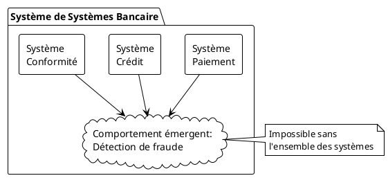
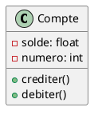
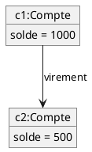
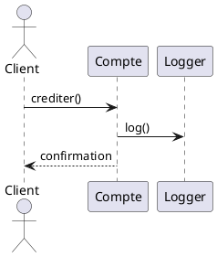
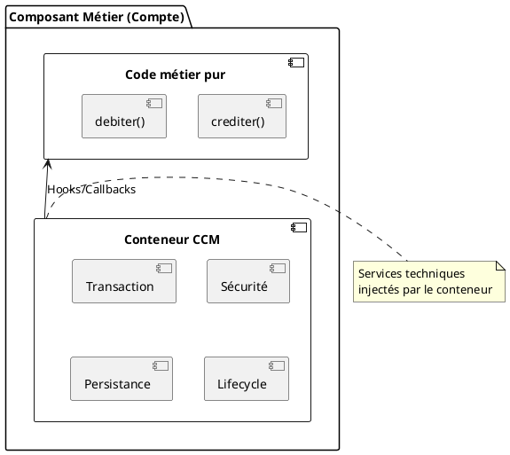
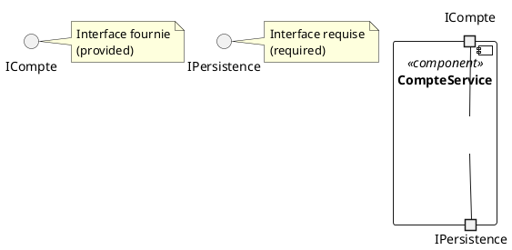
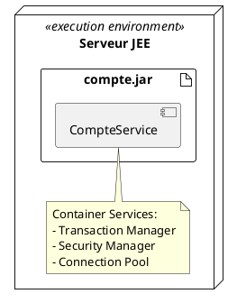
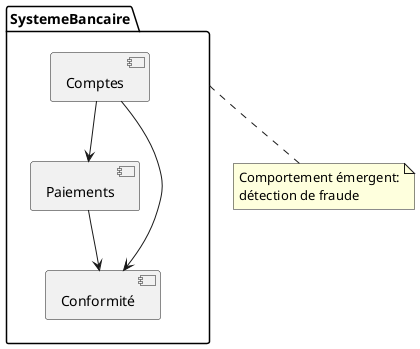
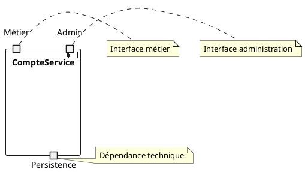
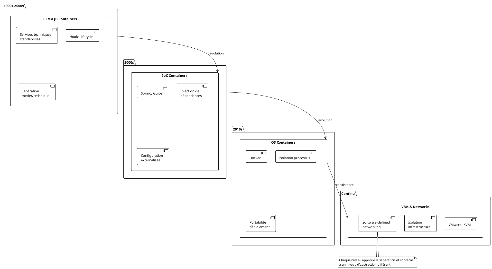

# De la Systémique aux Architectures à Composants
## Maîtriser la complexité par les changements de paradigmes

---

## Table des matières

1. [Introduction : Le défi de la complexité](#introduction)
2. [Fondements : La pensée systémique](#fondements)
3. [Premier paradigme : L'objet](#paradigme-objet)
4. [Second paradigme : Le composant](#paradigme-composant)
5. [Manifestations technologiques](#technologies)
6. [Modélisation UML : Évolution des constructions](#uml)
7. [Limites et anti-patterns](#limites)
8. [Perspectives et recommandations](#perspectives)

---

## 1. Introduction : Le défi de la complexité {#introduction}

### 1.1 Le problème fondamental

Les systèmes logiciels modernes sont confrontés à une **explosion de complexité** :
- Millions de lignes de code
- Centaines d'interactions
- Évolutions constantes
- Multiples parties prenantes

**Question centrale** : Comment maîtriser cette complexité sans la subir ?

### 1.2 La réponse : changements de paradigmes

L'histoire de l'ingénierie logicielle montre trois grandes ruptures :
1. **Programmation structurée** → maîtrise de l'algorithmique
2. **Paradigme objet** → encapsulation et modularité
3. **Paradigme composant** → séparation des préoccupations et composition

Ces ruptures ne sont pas fortuites : elles découlent toutes de la **pensée systémique**.

---

## 2. Fondements : La pensée systémique {#fondements}

### 2.1 Définition (De Rosnay, "Le Macroscope", 1975)

> "Un système est un ensemble d'éléments en interaction dynamique, organisés en fonction d'un but."

**Principes clés** :
- **Globalité** : le tout ≠ somme des parties
- **Interaction** : les relations comptent autant que les éléments
- **Organisation** : structure et fonction sont liées
- **Complexité** : propriétés émergentes

### 2.2 Systèmes de systèmes (SoS)

**Caractéristiques** :
- Indépendance opérationnelle des constituants
- Indépendance managériale
- Distribution géographique
- Évolution continue
- **Comportements émergents** imprévisibles

**Exemple** : Un système bancaire
```
Système de systèmes bancaire
├── Système de paiement (autonome)
├── Système de crédit (autonome)
├── Système de conformité (autonome)
└── Comportement émergent : détection de fraude
    (impossible sans l'ensemble)
```

**PlantUML** :


### 2.3 Principes de maîtrise de la complexité

#### Décomposition hiérarchique
- Diviser en sous-systèmes cohérents
- Chaque niveau cache les détails du niveau inférieur

#### Séparation des préoccupations (Separation of Concerns)
- Isoler aspects orthogonaux
- Exemples : métier vs. technique, fonctionnel vs. non-fonctionnel

#### Composition > Héritage
- Assembler plutôt que dériver
- Flexibilité et réutilisation

#### Contrats et interfaces
- Définir les interactions, pas les implémentations
- Substitution et interchangeabilité

---

## 3. Premier paradigme : L'objet {#paradigme-objet}

### 3.1 Le shift conceptuel

**Avant** (programmation procédurale) :
- Données ↔ Traitements séparés
- Vision algorithmique

**Après** (POO) :
- Données + Comportements = **Objet**
- Vision entités métier

### 3.2 Principes systémiques incarnés

| Principe systémique | Manifestation POO |
|---------------------|-------------------|
| Encapsulation | Information hiding |
| Globalité | Cohésion d'un objet |
| Interaction | Messages entre objets |
| Hiérarchie | Composition et agrégation |

### 3.3 Apports de UML 1.x

**Nouveaux diagrammes** :

#### Diagramme de classes
```
┌─────────────────┐
│   Compte        │
├─────────────────┤
│ - solde: float  │
│ - numero: int   │
├─────────────────┤
│ + crediter()    │
│ + debiter()     │
└─────────────────┘
```

**PlantUML** :


**Met en évidence** : encapsulation métier

#### Diagramme d'objets
```
c1:Compte          c2:Compte
solde=1000 ────────> solde=500
         virement
```

**PlantUML** :


**Met en évidence** : interactions dynamiques

#### Diagramme de séquence
```
Client    Compte    Logger
  │         │         │
  │─crediter()─>      │
  │         │──log()──>
  │         │         │
  │<─confirmation──   │
```

**PlantUML** :


**Met en évidence** : orchestration, émergence comportementale

### 3.4 Exemple technologique : Java

```java
// Encapsulation métier
public class Compte {
    private double solde;  // Information hiding
    
    public void crediter(double montant) {
        // Invariant métier protégé
        if (montant > 0) {
            this.solde += montant;
        }
    }
}
```

### 3.5 Limites révélées

#### Le piège de l'héritage abusif
```java
// Anti-pattern : mélange métier/technique
public class Compte extends Serializable 
                     implements Identifiable {
    // Code métier pollué par préoccupations techniques
}
```

**Problèmes** :
- Couplage fort métier ↔ infrastructure
- Rigidité : impossible de changer la stratégie de persistance
- Violation de la séparation des préoccupations
- Interopérabilité compromise

#### Exemple réel : PDM (Product Data Management)
```java
// Hiérarchie technique polluant le métier
public abstract class PDMObject 
    implements Serializable, Versionable, Lockable {
    // ...
}

public class Part extends PDMObject {
    // Le métier "Part" hérite de contraintes techniques
}
```

---

## 4. Second paradigme : Le composant {#paradigme-composant}

### 4.1 Le shift conceptuel

**Avant** (objet) :
- Granularité fine
- Héritage comme mécanisme de réutilisation
- Déploiement = classes

**Après** (composant) :
- Granularité moyenne/grosse
- **Composition** comme mécanisme principal
- **Séparation stricte** préoccupations
- Déploiement = unités autonomes

### 4.2 Définition formelle (UML 2.0)

> "Un composant est une unité modulaire avec des interfaces bien définies, remplaçable dans son environnement."

**Caractéristiques** :
- Boîte noire
- Contrats explicites (interfaces fournies/requises)
- Déployable indépendamment
- Substituable

### 4.3 Systémique radicale

Le paradigme composant est la **traduction directe** des principes systémiques :

| Principe De Rosnay | Manifestation composant |
|--------------------|-------------------------|
| Globalité | Composant = système autonome |
| Interaction | Interfaces contractuelles |
| Organisation | Architecture à base de composants |
| Émergence | Assemblage → nouveaux services |
| Hiérarchie | Composants de composants |

### 4.4 Séparation of Concerns : le mécanisme clé

#### Illustration CCM (CORBA Component Model)

```
┌─────────────────────────────────────┐
│     Composant Métier (Compte)       │
│  ┌──────────────────────────────┐   │
│  │  Code métier pur             │   │
│  │  - crediter()                │   │
│  │  - debiter()                 │   │
│  └──────────────────────────────┘   │
│            ▲                         │
│            │ Hooks/Callbacks         │
│  ┌─────────┴──────────────────────┐ │
│  │    Conteneur CCM               │ │
│  │  - Transaction                 │ │
│  │  - Sécurité                    │ │
│  │  - Persistance                 │ │
│  │  - Lifecycle                   │ │
│  └────────────────────────────────┘ │
└─────────────────────────────────────┘
```

**PlantUML** :


**Avantages** :
1. **Métier pur** : aucune dépendance technique dans le code
2. **Interchangeabilité** : changer de base de données sans toucher au métier
3. **Contrats au déploiement** : configuration vs. héritage
4. **Évolution indépendante** : composants métier vs. techniques

#### Exemple EJB (Enterprise JavaBeans)

```java
// Code métier SANS pollution technique
@Stateless  // Simple annotation, pas d'héritage
public class CompteService {
    
    @PersistenceContext
    private EntityManager em;  // Injection, pas héritage
    
    @TransactionAttribute(REQUIRED)
    public void transferer(Compte src, Compte dst, double montant) {
        // Code métier pur
        src.debiter(montant);
        dst.crediter(montant);
        // Transaction gérée par le conteneur
    }
}
```

**Points clés** :
- Aucun `extends` technique
- Services injectés via conteneur
- Contrats déclaratifs (annotations ou XML)
- Métier testable indépendamment

### 4.5 Apports de UML 2.x

#### Diagramme de composants

```
       ┌─────────────────────────┐
       │   <<component>>         │
       │   CompteService         │
       ├─────────────────────────┤
◄──────┤○ ICompte (provided)     │
       │                         │
       │◄ IPersistence (required)├──────►
       └─────────────────────────┘
```

**Légende** :
- ○ Interface fournie (lollipop)
- ◄ Interface requise (socket)

**PlantUML** :


**Met en évidence** :
- Contrats explicites
- Dépendances inversées
- Points de variabilité

#### Diagramme de déploiement enrichi

```
┌────────────────────────────┐
│  <<execution environment>> │
│    Serveur JEE             │
│  ┌──────────────────────┐  │
│  │  <<artifact>>        │  │
│  │  compte.jar          │  │
│  │   ┌──────────────┐   │  │
│  │   │ CompteService│   │  │
│  │   └──────────────┘   │  │
│  └──────────────────────┘  │
└────────────────────────────┘
```

**PlantUML** :


**Met en évidence** :
- Environnement d'exécution (conteneur)
- Artefacts déployables
- Configuration vs. code

#### Diagramme de structure composite

```
┌─────────────────────────────────────┐
│     SystemeBancaire                 │
│  ┌──────────┐      ┌────────────┐  │
│  │ Comptes  │─────▶│ Paiements  │  │
│  └──────────┘      └────────────┘  │
│       │                   │         │
│       └──────┬────────────┘         │
│              ▼                       │
│       ┌─────────────┐                │
│       │ Conformité  │                │
│       └─────────────┘                │
└─────────────────────────────────────┘
       Comportement émergent :
       détection de fraude
```

**PlantUML** :


**Met en évidence** : systèmes de systèmes, émergence

#### Diagramme de ports

```
┌───────────────────────┐
│   CompteService       │
│                       │
│ □─○ port Métier       │  ← Interface métier
│                       │
│ □─○ port Admin        │  ← Interface administration
│                       │
│ □─◄ port Persistence  │  ← Dépendance technique
└───────────────────────┘
```

**PlantUML** :


**Met en évidence** : séparation des rôles/préoccupations

### 4.6 Évolution des notions de containers

#### Du CCM aux containers modernes

```
Évolution historique :

1. CCM/EJB Containers (1990s-2000s)
   ├─ Services techniques standardisés
   ├─ Hooks lifecycle
   └─ Séparation métier/technique forte

2. Conteneurs d'inversion de contrôle (2000s)
   ├─ Spring, Guice
   ├─ Injection de dépendances
   └─ Configuration externalisée

3. Containers OS (2010s)
   ├─ Docker
   ├─ Isolation processus
   └─ Portabilité déploiement

4. Virtual Machines & Networks (continu)
   ├─ VMware, Xen, KVM
   ├─ Isolation infrastructure
   └─ Software-defined networking
```

**PlantUML** :


**Constat** : Chaque niveau applique la **séparation of concerns** à un niveau d'abstraction différent :
- CCM : métier vs. services applicatifs
- Docker : application vs. OS
- VM : OS vs. hardware

---

## 5. Manifestations technologiques {#technologies}

### 5.1 CCM (CORBA Component Model)

#### Architecture

```
┌────────────────────────────────────────┐
│         Container Services             │
│  ┌──────────────────────────────────┐  │
│  │ Transaction Service              │  │
│  │ Security Service                 │  │
│  │ Persistence Service              │  │
│  │ Event Service                    │  │
│  │ Lifecycle Management             │  │
│  └──────────────────────────────────┘  │
│              ▲                          │
│              │ Hooks standardisés       │
│  ┌───────────┴──────────────────────┐  │
│  │   Component Implementation       │  │
│  │   (Code métier pur)              │  │
│  └──────────────────────────────────┘  │
└────────────────────────────────────────┘
```

#### Contrats CCM

```idl
// IDL CORBA : contrat pur
component Compte {
    provides ITransaction transact;
    uses IPersistence persist;
    emits EventSoldeNegatif alert;
    
    // Callbacks container
    // - component_created()
    // - component_activated()
    // - component_passivated()
    // - component_removed()
}
```

**Bénéfices** :
- Contrats indépendants du langage
- Interopérabilité garantie
- Services techniques réutilisables
- Métier dégagé de la technique

### 5.2 EJB (Enterprise JavaBeans)

```java
// Session Bean : composant métier
@Stateless
public class GestionCompteBean implements GestionCompteLocal {
    
    @Resource  // Injection, pas héritage
    private SessionContext ctx;
    
    @PersistenceContext
    private EntityManager em;
    
    @TransactionAttribute(TransactionAttributeType.REQUIRED)
    public void transferer(Long idSrc, Long idDst, double montant) {
        Compte src = em.find(Compte.class, idSrc);
        Compte dst = em.find(Compte.class, idDst);
        
        if (src.getSolde() < montant) {
            ctx.setRollbackOnly();  // Hook container
            throw new SoldeInsuffisantException();
        }
        
        src.debiter(montant);
        dst.crediter(montant);
        // Commit automatique si succès
    }
    
    // Lifecycle hooks (optionnels)
    @PostConstruct
    public void init() { /* ... */ }
    
    @PreDestroy
    public void cleanup() { /* ... */ }
}
```

**Architecture EJB**

```
┌───────────────────────────────────┐
│      EJB Container                │
│  ┌─────────────────────────────┐  │
│  │  Interceptors Chain         │  │
│  │  - Security                 │  │
│  │  - Transaction              │  │
│  │  - Monitoring               │  │
│  └──────────┬──────────────────┘  │
│             ▼                      │
│  ┌─────────────────────────────┐  │
│  │  EJB Instance Pool          │  │
│  │  - Lifecycle management     │  │
│  │  - State management         │  │
│  └─────────────────────────────┘  │
└───────────────────────────────────┘
```

### 5.3 Comparaison avec approches modernes

#### Spring (compromis)

```java
@Service  // Composant logique
@Transactional
public class CompteService {
    
    @Autowired  // Injection
    private CompteRepository repo;
    
    public void transferer(Compte src, Compte dst, double montant) {
        // Code métier
        src.debiter(montant);
        dst.crediter(montant);
        repo.save(src);
        repo.save(dst);
    }
}
```

**Analyse** :
- ✅ Injection de dépendances
- ✅ Séparation partielle (pas d'héritage technique)
- ⚠️ Annotations techniques dans code métier
- ⚠️ Moins de standardisation que EJB

#### Microservices typiques (régression)

```java
@RestController  // Technique
@RequestMapping("/comptes")
public class CompteController {  // Mélange présentation/métier
    
    @Autowired
    private JdbcTemplate jdbc;  // Mélange métier/persistence
    
    @PostMapping("/transfert")
    @Transactional
    public ResponseEntity<Void> transferer(
            @RequestBody TransfertDTO dto) {  // Technique
        
        // Logique métier mêlée à REST/persistence
        Compte src = findById(dto.getSrcId());
        Compte dst = findById(dto.getDstId());
        
        src.debiter(dto.getMontant());
        dst.crediter(dto.getMontant());
        
        jdbc.update("UPDATE compte SET solde=? WHERE id=?", 
                    src.getSolde(), src.getId());
        jdbc.update("UPDATE compte SET solde=? WHERE id=?",
                    dst.getSolde(), dst.getId());
        
        return ResponseEntity.ok().build();
    }
}
```

**Problèmes** :
- ❌ Mélange présentation/métier/persistence
- ❌ Code métier non testable indépendamment
- ❌ Pas de séparation of concerns
- ❌ Difficile à faire évoluer

---

## 6. Modélisation UML : Évolution des constructions {#uml}

### 6.1 Tableau récapitulatif

| Besoin systémique | UML 1.x (objet) | UML 2.x (composant) |
|-------------------|-----------------|---------------------|
| Encapsulation | Classe | Composant |
| Interaction | Messages | Interfaces fournies/requises |
| Hiérarchie | Composition d'objets | Composition de composants |
| Substitution | Héritage/Interface | Ports et interfaces |
| Déploiement | - | Artifacts + containers |
| Séparation concerns | Packages | Composants + ports |
| Émergence | Séquence | Structure composite |

### 6.2 Exemple complet : Système bancaire

#### Vue objet (UML 1.x)

```
Diagramme de classes
┌──────────────┐         ┌──────────────┐
│   Compte     │◇────────│ Transaction  │
├──────────────┤         ├──────────────┤
│ -solde       │         │ -montant     │
│ -numero      │         │ -date        │
├──────────────┤         ├──────────────┤
│ +crediter()  │         │ +executer()  │
│ +debiter()   │         └──────────────┘
└──────────────┘
      △
      │
┌─────┴────────┐
│ CompteEpargne│
└──────────────┘
```

**Limites visibles** :
- Pas de visualisation des préoccupations techniques
- Héritage = couplage fort
- Pas de notion de déploiement

#### Vue composant (UML 2.x)

```
Diagramme de composants
┌────────────────────────────────────┐
│  <<component>>                     │
│  GestionCompte                     │
│                                    │
│  Ports:                            │
│  □─○ Métier (ICompte)              │  ← Interface métier pure
│  □─○ Admin (IAdmin)                │  ← Interface administration
│  □─◄ Persistence (IRepository)    │  ← Dépendance technique
│  □─◄ Notification (IEvents)       │  ← Dépendance technique
└────────────────────────────────────┘
         │                    │
         ▼                    ▼
┌─────────────────┐  ┌─────────────────┐
│ <<component>>   │  │ <<component>>   │
│ JpaPersistence  │  │ KafkaEvents     │
└─────────────────┘  └─────────────────┘
    Interchangeable       Interchangeable
```

**Avantages visibles** :
- ✅ Séparation métier/technique explicite
- ✅ Points de variation identifiés
- ✅ Interchangeabilité des implémentations
- ✅ Testabilité (mock des ports requis)

#### Vue déploiement

```
┌──────────────────────────────────────────┐
│  <<execution environment>>               │
│  Serveur Application (WildFly)           │
│  ┌────────────────────────────────────┐  │
│  │  <<artifact>> banque.ear           │  │
│  │  ┌──────────────────────────────┐  │  │
│  │  │ <<component>>                │  │  │
│  │  │ GestionCompte                │  │  │
│  │  └──────────────────────────────┘  │  │
│  │  ┌──────────────────────────────┐  │  │
│  │  │ <<component>>                │  │  │
│  │  │ JpaPersistence               │  │  │
│  │  └──────────────────────────────┘  │  │
│  └────────────────────────────────────┘  │
│                                          │
│  Container Services:                     │
│  - Transaction Manager                   │
│  - Security Manager                      │
│  - Connection Pool                       │
└──────────────────────────────────────────┘
```

### 6.3 Modélisation MBSE/EA

#### Niveaux d'abstraction (ArchiMate)

```
┌─────────────────────────────────────────┐
│  MOTIVATION (Pourquoi?)                 │
│  - Objectifs: "Réduire les fraudes"    │
│  - Stakeholders: Direction, Clients     │
└─────────────────┬───────────────────────┘
                  │
┌─────────────────▼───────────────────────┐
│  BUSINESS (Quoi?)                       │
│  - Processus: "Vérifier transaction"   │
│  - Services: "Détection anomalies"     │
└─────────────────┬───────────────────────┘
                  │
┌─────────────────▼───────────────────────┐
│  APPLICATION (Comment logique?)         │
│  - Composants: GestionCompte           │
│  - Services: ICompte, ITransaction     │
└─────────────────┬───────────────────────┘
                  │
┌─────────────────▼───────────────────────┐
│  TECHNOLOGY (Comment physique?)         │
│  - Serveurs: WildFly, PostgreSQL       │
│  - Réseaux: Load balancer              │
└─────────────────────────────────────────┘
```

**Séparation of concerns verticale** :
- Chaque niveau répond à une préoccupation distincte
- Traçabilité motivation → réalisation
- Indépendance des choix techniques

---

## 7. Limites et anti-patterns {#limites}

### 7.1 Le piège de l'héritage technique

#### Anti-pattern classique

```java
// Hiérarchie technique envahissante
public abstract class PersistentObject 
    implements Serializable, Versionable {
    protected Long id;
    protected int version;
    protected Date lastModified;
    
    public abstract void validate();
}

// Le métier pollué
public class Compte extends PersistentObject {
    private double solde;  // Métier
    
    @Override
    public void validate() {
        // Mélange validation métier et technique
    }
}
```

**Conséquences** :
1. Impossible de changer de stratégie de persistence
2. Tests unitaires compliqués (dépendances techniques)
3. Couplage fort métier ↔ infrastructure
4. Violation de l'Inversion de Dépendances

#### Solution composant

```java
// Métier pur
public class Compte {
    private double solde;
    
    public void crediter(double montant) {
        // Logique métier pure
        if (montant <= 0) throw new IllegalArgumentException();
        this.solde += montant;
    }
}

// Persistence séparée
@Component
public class CompteRepository {
    @PersistenceContext
    private EntityManager em;
    
    public void save(Compte compte) {
        // Logique persistence isolée
    }
}
```

### 7.2 Problèmes d'interopérabilité

#### Cas réel : Intégration PDM/ERP

```java
// Système A (PDM)
public class Part extends PDMObject {
    // Hérite de : Serializable, Lockable, Versionable
}

// Système B (ERP)
public class Article extends ERPEntity {
    // Hérite de : Auditable, Traceable
}

// Impossible de mapper directement !
// Part et Article ont des hiérarchies incompatibles
```

#### Solution composant

```java
// Interface neutre
public interface IProduct {
    String getReference();
    String getDescription();
}

// Adaptateurs
@Component
public class PartAdapter implements IProduct {
    private Part part;  // Composition, pas héritage
    
    public String getReference() {
        return part.getPartNumber();
    }
}

@Component
public class ArticleAdapter implements IProduct {
    private Article article;
    
    public String getReference() {
        return article.getCode();
    }
}
```

### 7.3 Microservices : pertes vs. gains

#### Ce qu'on a perdu (vs. CCM/EJB)

| Aspect | CCM/EJB | Microservices |
|--------|---------|---------------|
| Séparation concerns | Standardisée | Ad-hoc |
| Contrats | IDL/Interfaces Java | REST/gRPC (souvent informel) |
| Services techniques | Conteneur | Bibliothèques (code) |
| Interchangeabilité | Configuration | Réécriture |
| Testabilité métier | Excellente | Variable |

#### Ce qu'on a gagné

- ✅ Scalabilité indépendante
- ✅ Déploiement indépendant
- ✅ Polyglottisme technologique
- ✅ Organisation en équipes autonomes

#### Le compromis optimal ?

```
Microservices + Patterns architecturaux systémiques

Service "Comptes" (microservice)
├── API Layer (REST)
├── Application Layer
│   └── Composants métier (séparation concerns)
│       ├── CompteService (métier pur)
│       └── Ports/Adapters
├── Infrastructure Layer
│   └── Composants techniques interchangeables
└── Container (Docker + orchestration)
```

---

## 8. Perspectives et recommandations {#perspectives}

### 8.1 Principes directeurs

Pour maîtriser la complexité des systèmes modernes :

1. **Penser systémique d'abord**
   - Identifier les sous-systèmes
   - Définir les interactions
   - Anticiper l'émergence

2. **Séparer radicalement les préoccupations**
   - Métier vs. technique
   - Fonctionnel vs. non-fonctionnel
   - Stable vs. volatile

3. **Privilégier la composition**
   - Interfaces explicites
   - Couplage faible
   - Interchangeabilité

4. **Utiliser l'héritage avec parcimonie**
   - Uniquement pour les relations "est-un" métier
   - Jamais pour des préoccupations techniques
   - Préférer les interfaces

### 8.2 Architecture moderne recommandée

#### Structure en couches + composants

```
┌─────────────────────────────────────────┐
│  Presentation Layer (API)               │
│  - REST Controllers (adaptateurs)       │
└───────────────┬─────────────────────────┘
                │
┌───────────────▼─────────────────────────┐
│  Domain Layer                           │
│  - Entités métier                       │
│  - Règles métier                        │
│  - Interfaces de ports (abstractions)   │
└───────────────┬─────────────────────────┘
                │
┌───────────────▼─────────────────────────┐
│  Infrastructure Layer                   │
│  - Adaptateurs techniques               │
│  - Implémentations de ports             │
│  - Services externes                    │
└─────────────────────────────────────────┘
```

**Caractéristiques clés** :
- ✅ Domain pur sans dépendances techniques
- ✅ Inversion de dépendances (ports/adapters)
- ✅ Composants interchangeables
- ✅ Testabilité maximale

#### Exemple concret : Architecture hexagonale

```
         ┌──────────────────────────────────┐
         │  Adaptateurs Primaires (In)     │
         │  - REST API                      │
         │  - GraphQL                       │
         │  - Message Queue Consumer        │
         └────────────┬─────────────────────┘
                      │
         ┌────────────▼─────────────────────┐
         │  <<component>> Application       │
         │                                  │
         │  ┌────────────────────────────┐  │
         │  │  Use Cases (métier pur)    │  │
         │  │  - TransfererArgent        │  │
         │  │  - OuvrirCompte            │  │
         │  └────────────────────────────┘  │
         │            │                     │
         │  ┌─────────▼──────────────────┐  │
         │  │  Domain Model              │  │
         │  │  - Compte (entité)         │  │
         │  │  - Règles métier           │  │
         │  └────────────────────────────┘  │
         │            │                     │
         │  ┌─────────▼──────────────────┐  │
         │  │  Ports (interfaces)        │  │
         │  │  ◄ ICompteRepository       │  │
         │  │  ◄ INotificationService    │  │
         │  │  ◄ IAuditLog               │  │
         │  └────────────────────────────┘  │
         └────────────┬─────────────────────┘
                      │
         ┌────────────▼─────────────────────┐
         │  Adaptateurs Secondaires (Out)   │
         │  - JpaCompteRepository           │
         │  - KafkaNotificationService      │
         │  - ElasticsearchAuditLog         │
         └──────────────────────────────────┘
              Interchangeables
```

### 8.3 Patterns architecturaux systémiques

#### Pattern 1 : Ports & Adapters (Hexagonal)

**Problème** : Isoler le métier des détails techniques

**Solution** :
```java
// Port (interface du domain)
public interface ICompteRepository {
    Compte findById(Long id);
    void save(Compte compte);
}

// Adapter (infrastructure)
@Component
public class JpaCompteRepository implements ICompteRepository {
    @PersistenceContext
    private EntityManager em;
    
    public Compte findById(Long id) {
        return em.find(Compte.class, id);
    }
    
    public void save(Compte compte) {
        em.persist(compte);
    }
}

// Use Case (application) - ne dépend que du port
public class TransfererArgentUseCase {
    private final ICompteRepository repository;
    
    public TransfererArgentUseCase(ICompteRepository repository) {
        this.repository = repository;  // Injection
    }
    
    public void executer(Long srcId, Long dstId, double montant) {
        Compte src = repository.findById(srcId);
        Compte dst = repository.findById(dstId);
        
        // Logique métier pure
        src.debiter(montant);
        dst.crediter(montant);
        
        repository.save(src);
        repository.save(dst);
    }
}
```

**Bénéfices systémiques** :
- Séparation préoccupations radicale
- Interchangeabilité (PostgreSQL → MongoDB)
- Testabilité (mock du repository)
- Inversion de dépendances

#### Pattern 2 : Event-Driven Components

**Problème** : Couplage temporel et spatial entre composants

**Solution** :
```java
// Événement métier (domain)
public class CompteDebiteEvent {
    private final Long compteId;
    private final double montant;
    private final Instant date;
    // ...
}

// Composant émetteur
@Component
public class CompteService {
    private final IEventPublisher publisher;
    
    public void debiter(Long id, double montant) {
        Compte compte = repository.findById(id);
        compte.debiter(montant);
        repository.save(compte);
        
        // Publication événement
        publisher.publish(new CompteDebiteEvent(id, montant, now()));
    }
}

// Composants récepteurs (découplés)
@Component
public class NotificationListener {
    @EventListener
    public void onCompteDebite(CompteDebiteEvent event) {
        // Notifier le client
    }
}

@Component
public class FraudeDetectionListener {
    @EventListener
    public void onCompteDebite(CompteDebiteEvent event) {
        // Analyser fraude potentielle
    }
}
```

**Architecture événementielle**

```
┌──────────────┐         Events        ┌──────────────────┐
│  Composant A │────────────────────────▶│  Event Bus       │
│  (Publisher) │                        │  (Kafka/RabbitMQ)│
└──────────────┘                        └─────────┬────────┘
                                                  │
                              ┌───────────────────┼───────────────┐
                              │                   │               │
                     ┌────────▼────────┐ ┌────────▼────┐ ┌───────▼──────┐
                     │  Composant B    │ │ Composant C │ │ Composant D  │
                     │  (Subscriber)   │ │ (Subscriber)│ │ (Subscriber) │
                     └─────────────────┘ └─────────────┘ └──────────────┘
                        Indépendants      Indépendants    Indépendants
```

**Bénéfices systémiques** :
- Découplage spatial (composants ne se connaissent pas)
- Découplage temporel (asynchrone)
- Extensibilité (nouveaux listeners sans modifier émetteurs)
- Émergence (comportements globaux via composition d'événements)

#### Pattern 3 : CQRS (Command Query Responsibility Segregation)

**Problème** : Modèle unique contraint par besoins contradictoires

**Solution** :
```
┌────────────────────────────────────────────┐
│  Write Side (Commands)                     │
│  ┌──────────────────────────────────────┐  │
│  │  Composant écriture                  │  │
│  │  - Règles métier complexes           │  │
│  │  - Validations                       │  │
│  │  - Transactions                      │  │
│  └──────────────┬───────────────────────┘  │
│                 │ Events                    │
└─────────────────┼───────────────────────────┘
                  │
┌─────────────────▼───────────────────────────┐
│  Read Side (Queries)                        │
│  ┌──────────────────────────────────────┐   │
│  │  Composant lecture                   │   │
│  │  - Vue dénormalisée                  │   │
│  │  - Optimisée pour requêtes           │   │
│  │  - Pas de logique métier             │   │
│  └──────────────────────────────────────┘   │
└─────────────────────────────────────────────┘
```

**Code illustratif** :
```java
// Write Side - Composant commande
@Component
public class CompteCommandHandler {
    public void handle(DebiterCompteCommand cmd) {
        Compte compte = repository.findById(cmd.getCompteId());
        compte.debiter(cmd.getMontant());
        repository.save(compte);
        
        eventPublisher.publish(
            new CompteDebiteEvent(compte.getId(), cmd.getMontant())
        );
    }
}

// Read Side - Composant query (projection)
@Component
public class CompteQueryHandler {
    @Autowired
    private CompteReadRepository readRepo;  // Base différente!
    
    public CompteDTO getCompte(Long id) {
        return readRepo.findById(id);  // Lecture optimisée
    }
    
    @EventListener
    public void onCompteDebite(CompteDebiteEvent event) {
        // Mettre à jour la projection
        CompteDTO dto = readRepo.findById(event.getCompteId());
        dto.setSolde(dto.getSolde() - event.getMontant());
        readRepo.save(dto);
    }
}
```

**Bénéfices systémiques** :
- Séparation lecture/écriture
- Scalabilité indépendante
- Modèles optimisés pour leur usage
- Complexité maîtrisée

### 8.4 Modélisation recommandée

#### Démarche systémique

```
1. Espace Problème (MBSE)
   ├─ Identifier stakeholders et objectifs
   ├─ Définir les systèmes et sous-systèmes
   ├─ Identifier les interactions
   └─ Anticiper l'émergence

2. Espace Solution - Fonctionnel
   ├─ Diagrammes de Use Cases
   ├─ Diagrammes d'activité (processus)
   └─ Diagrammes d'état (comportements)

3. Espace Solution - Logique
   ├─ Diagrammes de composants
   │  └─ Avec ports et interfaces
   ├─ Diagrammes de structure composite
   │  └─ Systèmes de systèmes
   └─ Diagrammes de séquence
      └─ Interactions entre composants

4. Espace Solution - Réalisation
   ├─ Diagrammes de déploiement
   │  └─ Containers et environnements
   ├─ Diagrammes de classes (détail)
   └─ Choix technologiques
```

#### Exemple de traçabilité complète

```
┌─────────────────────────────────────────────┐
│  MOTIVATION                                 │
│  Objectif: Détecter fraudes bancaires      │
└───────────────┬─────────────────────────────┘
                │ réalisé par
┌───────────────▼─────────────────────────────┐
│  BUSINESS                                   │
│  Service: Surveillance transactions         │
│  Processus: Analyser chaque opération      │
└───────────────┬─────────────────────────────┘
                │ implémenté par
┌───────────────▼─────────────────────────────┐
│  LOGIQUE (Composants)                       │
│  ┌─────────────┐  ┌──────────────────┐     │
│  │ Composant   │  │ Composant        │     │
│  │ Transaction │─▶│ FraudeDetection  │     │
│  └─────────────┘  └──────────────────┘     │
│       │ Events           │                  │
│       └──────────────────┘                  │
│       Émergence: détection patterns         │
└───────────────┬─────────────────────────────┘
                │ déployé sur
┌───────────────▼─────────────────────────────┐
│  RÉALISATION                                │
│  - Microservice "transactions" (Docker)     │
│  - Microservice "fraud-detection" (Docker)  │
│  - Kafka pour événements                    │
│  - Kubernetes pour orchestration            │
└─────────────────────────────────────────────┘
```

### 8.5 Checklist pour architectes

#### ✓ Principes systémiques appliqués

- [ ] Les systèmes et sous-systèmes sont identifiés
- [ ] Les interactions sont modélisées explicitement
- [ ] Les comportements émergents sont anticipés
- [ ] La hiérarchie de composition est claire

#### ✓ Séparation of concerns

- [ ] Métier et technique sont séparés
- [ ] Aucun héritage technique dans le domaine
- [ ] Les préoccupations sont isolées dans des composants distincts
- [ ] Les interfaces définissent les contrats

#### ✓ Architecture à composants

- [ ] Composants avec interfaces explicites
- [ ] Ports et adapters pour l'infrastructure
- [ ] Inversion de dépendances respectée
- [ ] Composants interchangeables

#### ✓ Modélisation UML

- [ ] Diagrammes de composants avec ports
- [ ] Diagrammes de structure composite pour les SoS
- [ ] Diagrammes de déploiement avec containers
- [ ] Traçabilité motivation → réalisation

#### ✓ Évitabilité

- [ ] Pas d'héritage technique
- [ ] Couplage faible entre composants
- [ ] Dépendances unidirectionnelles
- [ ] Tests unitaires possibles sans infrastructure

### 8.6 Outils et technologies recommandés

#### Modélisation

| Outil | Usage | Points forts |
|-------|-------|--------------|
| **Enterprise Architect** | MBSE, ArchiMate | Traçabilité complète, multi-vues |
| **Sparx Systems** | UML 2.x complet | Composants, ports, SoS |
| **ArchiMate** | Architecture d'entreprise | Motivation → réalisation |
| **C4 Model** | Architecture système | Simple, pragmatique |

#### Frameworks alignés avec la systémique

| Framework | Paradigme | Séparation concerns |
|-----------|-----------|---------------------|
| **Spring Boot** | Composant (partiel) | ⭐⭐⭐ (avec discipline) |
| **Quarkus** | Composant moderne | ⭐⭐⭐⭐ |
| **Axon Framework** | CQRS/Event Sourcing | ⭐⭐⭐⭐⭐ |
| **Dapr** | Sidecar pattern | ⭐⭐⭐⭐ |
| **Kubernetes** | Container orchestration | ⭐⭐⭐⭐ |

#### Exemple Dapr (sidecar pattern)

```
┌────────────────────────────────────────┐
│  Application Container                 │
│  ┌──────────────────────────────────┐  │
│  │  Code métier pur                 │  │
│  │  (aucune dépendance technique)   │  │
│  └──────────────┬───────────────────┘  │
│                 │ API locale            │
│  ┌──────────────▼───────────────────┐  │
│  │  Dapr Sidecar                    │  │
│  │  - State management              │  │
│  │  - Pub/Sub                       │  │
│  │  - Service invocation            │  │
│  │  - Secrets                       │  │
│  └──────────────────────────────────┘  │
└────────────────────────────────────────┘
```

**Bénéfices** : Séparation radicale métier/technique, similaire à CCM

### 8.7 Cas d'étude : Migration d'un legacy

#### Situation initiale

```java
// Monolithe avec héritage technique
public class Compte extends BaseEntity 
    implements Serializable, Auditable {
    
    private double solde;
    
    @Transactional
    public void debiter(double montant) 
        throws SQLException, SecurityException {
        // Mélange métier/technique/infrastructure
        if (!SecurityContext.hasPermission("DEBIT")) {
            throw new SecurityException();
        }
        
        Connection conn = getConnection();
        conn.setAutoCommit(false);
        
        // Logique métier noyée
        if (solde < montant) {
            conn.rollback();
            throw new SoldeInsuffisantException();
        }
        
        solde -= montant;
        
        PreparedStatement stmt = conn.prepareStatement(
            "UPDATE compte SET solde=? WHERE id=?");
        stmt.setDouble(1, solde);
        stmt.setLong(2, id);
        stmt.executeUpdate();
        
        conn.commit();
        
        auditLog.log("DEBIT", montant);
    }
}
```

**Problèmes** :
- ❌ Tout mélangé : métier, sécurité, persistence, audit
- ❌ Impossible à tester unitairement
- ❌ Impossible de changer de base de données
- ❌ Couplage fort à JDBC

#### Architecture cible (composants)

```java
// 1. Domain pur
public class Compte {
    private double solde;
    
    public void debiter(double montant) {
        // Logique métier PURE
        if (montant <= 0) {
            throw new IllegalArgumentException("Montant invalide");
        }
        if (solde < montant) {
            throw new SoldeInsuffisantException();
        }
        solde -= montant;
    }
}

// 2. Use Case (application)
@Component
public class DebiterCompteUseCase {
    private final ICompteRepository repository;
    private final ISecurityService security;
    private final IAuditService audit;
    
    public DebiterCompteUseCase(
            ICompteRepository repository,
            ISecurityService security,
            IAuditService audit) {
        this.repository = repository;
        this.security = security;
        this.audit = audit;
    }
    
    @Transactional
    public void executer(Long compteId, double montant) {
        // Vérification sécurité (aspect orthogonal)
        security.checkPermission("DEBIT");
        
        // Logique métier
        Compte compte = repository.findById(compteId);
        compte.debiter(montant);
        repository.save(compte);
        
        // Audit (aspect orthogonal)
        audit.log("DEBIT", compteId, montant);
    }
}

// 3. Adapters (infrastructure) - interchangeables
@Component
public class JpaCompteRepository implements ICompteRepository {
    @PersistenceContext
    private EntityManager em;
    
    public Compte findById(Long id) {
        return em.find(Compte.class, id);
    }
    
    public void save(Compte compte) {
        em.merge(compte);
    }
}
```

**Diagramme de composants de la solution**

```
┌────────────────────────────────────────────┐
│  API Layer                                 │
│  CompteController (REST adapter)           │
└─────────────────┬──────────────────────────┘
                  │
┌─────────────────▼──────────────────────────┐
│  Application Layer                         │
│  ┌──────────────────────────────────────┐  │
│  │  DebiterCompteUseCase                │  │
│  │  (orchestration, pas de technique)   │  │
│  └──┬───────────────┬──────────────┬────┘  │
│     │               │              │        │
│     │ ◄ICompteRepo  │ ◄ISecurity   │ ◄IAudit│
└─────┼───────────────┼──────────────┼────────┘
      │               │              │
┌─────▼───────────────▼──────────────▼────────┐
│  Infrastructure Layer                       │
│  ┌──────────────┐ ┌──────────┐ ┌─────────┐ │
│  │ JpaRepo      │ │ KeyCloak │ │ ELK     │ │
│  │ (PostgreSQL) │ │ Security │ │ Audit   │ │
│  └──────────────┘ └──────────┘ └─────────┘ │
│     ↕                ↕            ↕         │
│  [MongoDB]        [LDAP]      [Kafka]      │
│  Interchangeable  Interchangeable           │
└─────────────────────────────────────────────┘
```

#### Plan de migration

**Phase 1 : Extraction du domaine**
- Créer classes domaine pures
- Tests unitaires (sans infrastructure)
- Pas de changement externe

**Phase 2 : Introduction des ports**
- Définir interfaces (ICompteRepository, etc.)
- Créer adaptateurs existants (wrapper legacy)
- Tests d'intégration

**Phase 3 : Use Cases**
- Créer couche application
- Orchestration via use cases
- Remplacer appels directs

**Phase 4 : Nouveaux adaptateurs**
- Implémenter adaptateurs modernes
- Basculement progressif
- Anciens adaptateurs coexistent

**Phase 5 : Décommissionnement**
- Retirer code legacy
- Documentation architecture

### 8.8 Métriques de qualité systémique

#### Indicateurs à suivre

| Métrique | Objectif | Calcul |
|----------|----------|--------|
| **Couplage afférent (Ca)** | Minimiser | Nb composants dépendant de X |
| **Couplage efférent (Ce)** | Maîtriser | Nb composants dont X dépend |
| **Instabilité (I)** | Équilibrer | Ce / (Ca + Ce) |
| **Abstraction (A)** | Maximiser domaine | Nb interfaces / nb classes |
| **Distance main sequence** | Minimiser | \|A + I - 1\| |

#### Exemples d'analyse

```
Composant "CompteService"
├─ Ca = 5 (utilisé par 5 composants)
├─ Ce = 2 (dépend de 2 composants)
├─ I = 0.28 (stable)
└─ ✅ Bon : composant stable réutilisé

Composant "JpaAdapter"
├─ Ca = 1 (utilisé par 1 use case)
├─ Ce = 3 (dépend de JPA, DB, etc.)
├─ I = 0.75 (instable)
└─ ✅ Bon : détail d'implémentation volatile
```

### 8.9 Formation et montée en compétence

#### Progression pédagogique recommandée

**Niveau 1 : Fondations systémiques**
- Lecture : "Le Macroscope" (De Rosnay)
- Exercices : modéliser systèmes quotidiens
- Identifier émergence

**Niveau 2 : POO maîtrisée**
- Principes SOLID
- Design patterns GoF
- Limites de l'héritage

**Niveau 3 : Composants**
- Architecture hexagonale
- Ports & Adapters
- UML 2.x (composants, ports)

**Niveau 4 : Systèmes de systèmes**
- MBSE (Model-Based Systems Engineering)
- ArchiMate
- Event-Driven Architecture

**Niveau 5 : Maîtrise**
- CQRS, Event Sourcing
- Microservices patterns
- Analyse d'architectures complexes

#### Exercices pratiques

**Exercice 1 : Identifier les violations**

Analyser du code legacy et identifier :
- Héritages techniques
- Mélanges de préoccupations
- Couplages forts

**Exercice 2 : Refactoring systémique**

Transformer un monolithe en architecture à composants :
1. Extraire le domaine
2. Définir les ports
3. Créer les adaptateurs
4. Modéliser en UML 2.x

**Exercice 3 : Système de systèmes**

Concevoir une architecture distribuée :
- Événements entre composants
- Comportements émergents
- Résilience

---

## 9. Conclusion : Vers une ingénierie systémique du logiciel

### 9.1 Synthèse des paradigmes

```
Complexité croissante
        │
        ▼
┌─────────────────┐
│  Procédural     │  → Maîtrise algorithmique
└────────┬────────┘
         │ Shift objet
         ▼
┌─────────────────┐
│  Objet (UML 1)  │  → Encapsulation, modularité
└────────┬────────┘    Limite : héritage technique
         │ Shift composant
         ▼
┌─────────────────┐
│ Composant (UML2)│  → Séparation of concerns
└────────┬────────┘    Composition > héritage
         │ Shift SoS
         ▼
┌─────────────────┐
│ Systèmes de     │  → Émergence, résilience
│ systèmes        │    Architecture distribuée
└─────────────────┘
```

### 9.2 Leçons essentielles

1. **La systémique est le fondement**
   - Tous les paradigmes en découlent
   - Elle guide les choix architecturaux
   - Elle permet d'anticiper la complexité

2. **La séparation des préoccupations est cruciale**
   - Combat efficace contre la rigidité
   - Permet l'évolution indépendante
   - Base de l'interchangeabilité

3. **L'héritage doit être limité**
   - Uniquement relations "est-un" métier
   - Jamais pour aspects techniques
   - Préférer composition et interfaces

4. **Les composants surpassent les objets**
   - Granularité adaptée à la complexité
   - Contrats explicites
   - Déploiement indépendant

5. **L'histoire se répète**
   - CCM/EJB avaient raison sur le fond
   - Microservices ont oublié certains principes
   - Il faut réconcilier les approches

### 9.3 Vision d'avenir

L'ingénierie logicielle doit revenir aux fondamentaux systémiques tout en intégrant les acquis modernes :

**Vers des "Systemic Microservices"** :
- Séparation radicale concerns (comme CCM)
- Scalabilité et autonomie (comme microservices)
- Modélisation rigoureuse (MBSE/UML 2.x)
- Standardisation des patterns

**Outils nécessaires** :
- Frameworks systémiques modernes (Dapr, Axon)
- Outillage de modélisation intégré
- Métriques de qualité systémique
- Formation généralisée

### 9.4 Appel à l'action

**Pour les étudiants** :
- Comprendre la systémique avant le code
- Maîtriser UML 2.x (composants, ports)
- Pratiquer la séparation of concerns
- Étudier les cas réels (succès et échecs)

**Pour les architectes** :
- Revisiter les principes CCM/EJB
- Appliquer la pensée systémique
- Modéliser avant de coder
- Évangéliser les bonnes pratiques

**Pour l'industrie** :
- Investir dans la formation
- Standardiser les patterns architecturaux
- Favoriser la modélisation
- Capitaliser sur l'histoire

---

## Bibliographie et ressources

### Ouvrages fondamentaux

**Systémique**
- De Rosnay, J. (1975). *Le Macroscope*
- Von Bertalanffy, L. (1968). *General System Theory*
- Le Moigne, J.-L. (1977). *La Théorie du Système Général*

**Architecture logicielle**
- Fowler, M. (2002). *Patterns of Enterprise Application Architecture*
- Vernon, V. (2013). *Implementing Domain-Driven Design*
- Richards, M. & Ford, N. (2020). *Fundamentals of Software Architecture*

**UML et modélisation**
- Booch, G., Rumbaugh, J., Jacobson, I. (2005). *The Unified Modeling Language User Guide*
- Roques, P. (2018). *UML 2.5 par la pratique*

**Composants**
- Szyperski, C. (2002). *Component Software: Beyond Object-Oriented Programming*
- Heineman, G.T. & Councill, W.T. (2001). *Component-Based Software Engineering*

### Standards et specifications

- **UML 2.5.1 Specification** (OMG)
- **ArchiMate 3.1 Specification** (The Open Group)
- **CORBA Component Model Specification** (OMG)
- **EJB 3.2 Specification** (Oracle/Jakarta EE)

### Ressources en ligne

- [Martin Fowler's blog](https://martinfowler.com) : patterns architecturaux
- [C4 Model](https://c4model.com) : modélisation pragmatique
- [Domain-Driven Design Community](https://dddcommunity.org)
- [Microservices.io](https://microservices.io) : patterns microservices

---

## Annexes

### Annexe A : Glossaire

**Comportement émergent** : Propriété d'un système qui apparaît de l'interaction de ses composants, non réductible à la somme de leurs propriétés individuelles.

**Composant** : Unité modulaire avec interfaces bien définies, remplaçable dans son environnement, déployable indépendamment.

**Conteneur** : Environnement d'exécution fournissant des services techniques (transaction, sécurité, persistance) aux composants via des mécanismes d'injection et de hooks.

**CQRS** : Command Query Responsibility Segregation - pattern séparant les opérations de lecture et d'écriture dans des modèles distincts.

**Héritage** : Mécanisme permettant à une classe de dériver d'une autre, créant un couplage fort. À utiliser uniquement pour relations "est-un" métier.

**Interface** : Contrat définissant des services sans spécifier leur implémentation, permettant le découplage et la substitution.

**MBSE** : Model-Based Systems Engineering - approche d'ingénierie utilisant des modèles formels pour définir, concevoir et documenter les systèmes.

**Port** : Point d'interaction d'un composant, peut être "fourni" (service offert) ou "requis" (dépendance).

**Séparation of Concerns** : Principe visant à isoler des aspects orthogonaux (métier/technique, lecture/écriture) dans des unités distinctes.

**Système de systèmes (SoS)** : Ensemble de systèmes indépendants qui coopèrent pour créer des capacités émergentes impossibles individuellement.

**Systémique** : Approche scientifique étudiant les systèmes comme des touts organisés plutôt que comme des sommes de parties.

### Annexe B : Patterns architecturaux systémiques

#### B.1 Catalog des patterns

| Pattern | Problème | Solution systémique | UML |
|---------|----------|---------------------|-----|
| **Ports & Adapters** | Isolation métier/technique | Interfaces + adaptateurs interchangeables | Diagramme composants avec ports |
| **Event-Driven** | Couplage temporel/spatial | Événements asynchrones | Diagramme communication |
| **CQRS** | Modèle unique contraint | Séparation lecture/écriture | Structure composite |
| **Saga** | Transactions distribuées | Orchestration compensable | Séquence + état |
| **Sidecar** | Services techniques répétitifs | Proxy technique découplé | Déploiement |
| **Strangler Fig** | Migration legacy | Remplacement progressif | Composants + versions |

#### B.2 Anti-patterns à éviter

| Anti-pattern | Symptôme | Conséquence | Remède |
|--------------|----------|-------------|--------|
| **God Component** | Composant faisant tout | Impossible à maintenir | Découper selon préoccupations |
| **Spaghetti Dependencies** | Cycles de dépendances | Évolution impossible | Inversion de dépendances |
| **Technical Inheritance** | Héritage pour aspects techniques | Couplage rigide | Composition + injection |
| **Anemic Domain** | Objets sans comportement | Logique dispersée | Enrichir le domaine |
| **Distributed Monolith** | Microservices fortement couplés | Complexité sans bénéfices | Revoir les frontières |

### Annexe C : Études de cas détaillées

#### C.1 Système bancaire - Architecture complète

##### Contexte métier

Un système bancaire doit gérer :
- Comptes clients (courants, épargne, titres)
- Opérations (virements, prélèvements, paiements)
- Détection de fraude en temps réel
- Conformité réglementaire (KYC, AML)
- Rapports et audit

##### Approche systémique

**Identification des systèmes** :
```
Système de systèmes bancaire
├── Système Gestion Comptes (autonome)
│   └── Responsabilité : CRUD comptes, soldes
├── Système Opérations (autonome)
│   └── Responsabilité : Exécuter transactions
├── Système Fraude (autonome)
│   └── Responsabilité : Analyser patterns suspects
├── Système Conformité (autonome)
│   └── Responsabilité : Vérifier règles réglementaires
└── Comportement émergent : Sécurité globale
    (aucun système seul ne peut l'assurer)
```

##### Architecture à composants

**Vue logique (UML 2.x)** :

```
┌────────────────────────────────────────────────┐
│  <<component>> GestionComptes                  │
│  ┌──────────────────────────────────────────┐  │
│  │  Ports fournis:                          │  │
│  │  ○ ICompteService (métier)               │  │
│  │  ○ ICompteQuery (lecture)                │  │
│  │                                          │  │
│  │  Ports requis:                           │  │
│  │  ◄ ICompteRepository (persistence)       │  │
│  │  ◄ IEventPublisher (événements)          │  │
│  └──────────────────────────────────────────┘  │
│                                                │
│  Events émis:                                  │
│  - CompteOuvert                                │
│  - CompteFerme                                 │
│  - SoldeModifie                                │
└────────────────────────────────────────────────┘

┌────────────────────────────────────────────────┐
│  <<component>> GestionOperations               │
│  ┌──────────────────────────────────────────┐  │
│  │  Ports fournis:                          │  │
│  │  ○ IOperationService                     │  │
│  │                                          │  │
│  │  Ports requis:                           │  │
│  │  ◄ ICompteService (autre composant)      │  │
│  │  ◄ IEventPublisher                       │  │
│  └──────────────────────────────────────────┘  │
│                                                │
│  Events émis:                                  │
│  - OperationExecutee                           │
│  - OperationRefusee                            │
└────────────────────────────────────────────────┘

┌────────────────────────────────────────────────┐
│  <<component>> DetectionFraude                 │
│  ┌──────────────────────────────────────────┐  │
│  │  Ports fournis:                          │  │
│  │  ○ IFraudeAnalyse                        │  │
│  │                                          │  │
│  │  Ports requis:                           │  │
│  │  ◄ IEventSubscriber (écoute)             │  │
│  │  ◄ IMLModel (machine learning)           │  │
│  └──────────────────────────────────────────┘  │
│                                                │
│  Events écoutés:                               │
│  - OperationExecutee (de GestionOperations)    │
│  - SoldeModifie (de GestionComptes)            │
│                                                │
│  Comportement émergent:                        │
│  Détection de patterns de fraude par          │
│  corrélation d'événements multi-composants     │
└────────────────────────────────────────────────┘
```

##### Implémentation

**Composant GestionComptes** :

```java
// 1. Domain (métier pur)
public class Compte {
    private final String numero;
    private Money solde;
    private final TypeCompte type;
    
    // Constructeur
    public Compte(String numero, TypeCompte type) {
        this.numero = numero;
        this.type = type;
        this.solde = Money.ZERO;
    }
    
    // Logique métier pure
    public void crediter(Money montant) {
        if (montant.isNegativeOrZero()) {
            throw new MontantInvalideException();
        }
        this.solde = this.solde.plus(montant);
    }
    
    public void debiter(Money montant) {
        if (montant.isNegativeOrZero()) {
            throw new MontantInvalideException();
        }
        if (!peutDebiter(montant)) {
            throw new SoldeInsuffisantException();
        }
        this.solde = this.solde.minus(montant);
    }
    
    private boolean peutDebiter(Money montant) {
        return this.solde.isGreaterThanOrEqual(montant);
    }
    
    // Getters
    public Money getSolde() { return solde; }
    public String getNumero() { return numero; }
}

// 2. Ports (interfaces)
public interface ICompteService {
    void crediterCompte(String numero, Money montant);
    void debiterCompte(String numero, Money montant);
    Compte ouvrirCompte(String numero, TypeCompte type);
}

public interface ICompteRepository {
    Compte findByNumero(String numero);
    void save(Compte compte);
}

public interface IEventPublisher {
    void publish(DomainEvent event);
}

// 3. Events (domaine)
public class SoldeModifieEvent implements DomainEvent {
    private final String numeroCompte;
    private final Money ancienSolde;
    private final Money nouveauSolde;
    private final Instant timestamp;
    
    // Constructor, getters...
}

// 4. Use Cases (application)
@Component
public class CompteServiceImpl implements ICompteService {
    
    private final ICompteRepository repository;
    private final IEventPublisher eventPublisher;
    
    @Autowired
    public CompteServiceImpl(
            ICompteRepository repository,
            IEventPublisher eventPublisher) {
        this.repository = repository;
        this.eventPublisher = eventPublisher;
    }
    
    @Override
    @Transactional
    public void crediterCompte(String numero, Money montant) {
        // Récupération
        Compte compte = repository.findByNumero(numero);
        
        // Snapshot pour événement
        Money ancienSolde = compte.getSolde();
        
        // Logique métier
        compte.crediter(montant);
        
        // Persistence
        repository.save(compte);
        
        // Événement (pour autres composants)
        eventPublisher.publish(new SoldeModifieEvent(
            numero, ancienSolde, compte.getSolde(), Instant.now()
        ));
    }
    
    // Autres méthodes...
}

// 5. Adaptateurs (infrastructure)
@Repository
public class JpaCompteRepository implements ICompteRepository {
    
    @PersistenceContext
    private EntityManager em;
    
    @Override
    public Compte findByNumero(String numero) {
        CompteEntity entity = em.createQuery(
            "SELECT c FROM CompteEntity c WHERE c.numero = :numero",
            CompteEntity.class)
            .setParameter("numero", numero)
            .getSingleResult();
        
        // Mapping entity → domain
        return toDomain(entity);
    }
    
    @Override
    public void save(Compte compte) {
        // Mapping domain → entity
        CompteEntity entity = toEntity(compte);
        em.merge(entity);
    }
    
    // Méthodes de mapping...
}

@Component
public class KafkaEventPublisher implements IEventPublisher {
    
    @Autowired
    private KafkaTemplate<String, String> kafka;
    
    @Override
    public void publish(DomainEvent event) {
        String json = serializeToJson(event);
        kafka.send("domain-events", event.getClass().getName(), json);
    }
}
```

**Composant DetectionFraude** :

```java
// 1. Domain
public class AnalyseFraude {
    private final List<RegleFraude> regles;
    private final IMLModel model;
    
    public ResultatAnalyse analyser(TransactionContext context) {
        // Règles business
        for (RegleFraude regle : regles) {
            if (regle.estSuspecte(context)) {
                return ResultatAnalyse.suspecte(regle.getRaison());
            }
        }
        
        // Machine Learning
        double score = model.predictFraudScore(context);
        if (score > 0.8) {
            return ResultatAnalyse.suspecte("Score ML élevé: " + score);
        }
        
        return ResultatAnalyse.normale();
    }
}

// 2. Event Listener (application)
@Component
public class FraudeEventListener {
    
    private final AnalyseFraude analyseFraude;
    private final IAlertService alertService;
    
    @EventListener
    public void onOperationExecutee(OperationExecuteeEvent event) {
        // Construire contexte d'analyse
        TransactionContext context = TransactionContext.builder()
            .compteId(event.getCompteId())
            .montant(event.getMontant())
            .typeOperation(event.getType())
            .timestamp(event.getTimestamp())
            .build();
        
        // Analyser
        ResultatAnalyse resultat = analyseFraude.analyser(context);
        
        // Réagir si suspect
        if (resultat.estSuspecte()) {
            alertService.envoyerAlerte(
                new AlerteFraude(event.getCompteId(), resultat.getRaison())
            );
        }
    }
    
    @EventListener
    public void onSoldeModifie(SoldeModifieEvent event) {
        // Analyser changement de solde
        if (event.getVariation().isGreaterThan(SEUIL_ALERTE)) {
            // Corrélation avec historique...
        }
    }
}
```

##### Architecture de déploiement

```
┌─────────────────────────────────────────────────────┐
│  Kubernetes Cluster                                 │
│                                                     │
│  ┌───────────────────────────────────────────────┐ │
│  │  Namespace: banking                           │ │
│  │                                               │ │
│  │  ┌──────────────────┐  ┌──────────────────┐  │ │
│  │  │ Pod: comptes     │  │ Pod: operations  │  │ │
│  │  │ ┌──────────────┐ │  │ ┌──────────────┐ │  │ │
│  │  │ │ Container    │ │  │ │ Container    │ │  │ │
│  │  │ │ GestionCompte│ │  │ │ Operations   │ │  │ │
│  │  │ └──────────────┘ │  │ └──────────────┘ │  │ │
│  │  │ ┌──────────────┐ │  │ ┌──────────────┐ │  │ │
│  │  │ │ Dapr Sidecar │ │  │ │ Dapr Sidecar │ │  │ │
│  │  │ │ - State      │ │  │ │ - PubSub     │ │  │ │
│  │  │ │ - PubSub     │ │  │ │ - Invocation │ │  │ │
│  │  │ └──────────────┘ │  │ └──────────────┘ │  │ │
│  │  └──────────────────┘  └──────────────────┘  │ │
│  │                                               │ │
│  │  ┌──────────────────┐                        │ │
│  │  │ Pod: fraude      │                        │ │
│  │  │ ┌──────────────┐ │                        │ │
│  │  │ │ Container    │ │                        │ │
│  │  │ │ DetectionFraude│                        │ │
│  │  │ └──────────────┘ │                        │ │
│  │  │ ┌──────────────┐ │                        │ │
│  │  │ │ Dapr Sidecar │ │                        │ │
│  │  │ │ - PubSub Sub │ │                        │ │
│  │  │ └──────────────┘ │                        │ │
│  │  └──────────────────┘                        │ │
│  └───────────────────────────────────────────────┘ │
│                                                     │
│  ┌───────────────────────────────────────────────┐ │
│  │  Infrastructure Services                      │ │
│  │  - PostgreSQL (state)                         │ │
│  │  - Kafka (events)                             │ │
│  │  - Redis (cache)                              │ │
│  └───────────────────────────────────────────────┘ │
└─────────────────────────────────────────────────────┘
```

##### Bénéfices obtenus

**Séparation of concerns** :
- ✅ Métier pur (classe `Compte`)
- ✅ Application orchestrée (use cases)
- ✅ Infrastructure interchangeable (adaptateurs)
- ✅ Déploiement découplé (pods K8s)

**Émergence** :
- ✅ Détection fraude par corrélation multi-sources
- ✅ Impossible sans les événements des 2 composants
- ✅ Chaque composant reste simple et focalisé

**Évolution** :
- ✅ Remplacer JPA par MongoDB : seul l'adaptateur change
- ✅ Ajouter nouveau type d'analyse fraude : nouveau listener
- ✅ Changer de message broker : configuration Dapr

#### C.2 E-Commerce - Migration legacy vers composants

##### Situation initiale (monolithe)

```java
// Tout dans une classe "God Object"
public class OrderManager extends BaseEntity 
    implements Serializable, Auditable {
    
    @Inject private EntityManager em;
    @Inject private EmailService email;
    @Inject private PaymentGateway payment;
    
    public void placeOrder(OrderDTO dto) throws Exception {
        // Mélange validation/métier/persistence/notification
        
        // Validation
        if (dto.getItems().isEmpty()) {
            throw new ValidationException("No items");
        }
        
        // Vérifier stock (accès direct DB)
        for (ItemDTO item : dto.getItems()) {
            Product p = em.find(Product.class, item.getProductId());
            if (p.getStock() < item.getQuantity()) {
                throw new OutOfStockException();
            }
        }
        
        // Créer commande
        Order order = new Order();
        order.setCustomerId(dto.getCustomerId());
        order.setStatus("PENDING");
        em.persist(order);
        
        // Paiement (appel synchrone)
        PaymentResult result = payment.charge(
            dto.getPaymentMethod(), 
            order.getTotalAmount()
        );
        
        if (!result.isSuccess()) {
            order.setStatus("FAILED");
            em.merge(order);
            throw new PaymentFailedException();
        }
        
        order.setStatus("PAID");
        em.merge(order);
        
        // Déduire stock
        for (ItemDTO item : dto.getItems()) {
            Product p = em.find(Product.class, item.getProductId());
            p.setStock(p.getStock() - item.getQuantity());
            em.merge(p);
        }
        
        // Email (synchrone, peut échouer)
        email.send(dto.getCustomerId(), "Order confirmation", ...);
        
        order.setStatus("COMPLETED");
        em.merge(order);
        
        // Audit
        auditLog("ORDER_PLACED", order.getId());
    }
}
```

**Problèmes** :
- ❌ 6 préoccupations différentes mélangées
- ❌ Transaction longue (payment + email)
- ❌ Couplage fort à toutes les dépendances
- ❌ Impossible de tester le métier seul
- ❌ Échec email = rollback complet
- ❌ Pas de retry sur paiement

##### Architecture cible (composants + saga)

**Vue composants** :

```
┌──────────────────┐  ┌──────────────────┐  ┌──────────────────┐
│ OrderService     │  │ InventoryService │  │ PaymentService   │
│ (orchestrateur)  │  │                  │  │                  │
└────────┬─────────┘  └────────┬─────────┘  └────────┬─────────┘
         │                     │                     │
         └─────────────────────┼─────────────────────┘
                               │
                    ┌──────────▼──────────┐
                    │   Event Bus (Kafka) │
                    └──────────┬──────────┘
                               │
         ┌─────────────────────┼─────────────────────┐
         │                     │                     │
┌────────▼─────────┐  ┌────────▼─────────┐  ┌───────▼──────────┐
│ NotificationSvc  │  │ AnalyticsService │  │ FraudService     │
└──────────────────┘  └──────────────────┘  └──────────────────┘
```

**Implémentation Saga** :

```java
// 1. Domain - Entité Commande
public class Order {
    private final OrderId id;
    private OrderStatus status;
    private final List<OrderLine> lines;
    private final CustomerId customerId;
    
    public static Order create(CustomerId customerId, List<OrderLine> lines) {
        // Validation métier
        if (lines.isEmpty()) {
            throw new EmptyOrderException();
        }
        return new Order(OrderId.generate(), customerId, lines);
    }
    
    public void markAsPaid() {
        if (status != OrderStatus.PENDING) {
            throw new InvalidStateTransitionException();
        }
        this.status = OrderStatus.PAID;
    }
    
    public void markAsFailed(String reason) {
        this.status = OrderStatus.FAILED;
    }
    
    public Money getTotalAmount() {
        return lines.stream()
            .map(OrderLine::getAmount)
            .reduce(Money.ZERO, Money::plus);
    }
}

// 2. Saga Orchestrator (Application Layer)
@Component
public class PlaceOrderSaga {
    
    private final IOrderRepository orderRepo;
    private final IInventoryService inventory;
    private final IPaymentService payment;
    private final IEventPublisher events;
    
    @Transactional
    public OrderId execute(PlaceOrderCommand cmd) {
        // Étape 1: Créer commande
        Order order = Order.create(
            cmd.getCustomerId(),
            cmd.getLines()
        );
        orderRepo.save(order);
        
        // Événement: OrderCreated
        events.publish(new OrderCreatedEvent(order.getId()));
        
        try {
            // Étape 2: Réserver stock (appel sync ou async)
            ReservationResult reservation = 
                inventory.reserve(order.getLines());
            
            if (!reservation.isSuccess()) {
                // Compensation: annuler commande
                order.markAsFailed("Stock insuffisant");
                orderRepo.save(order);
                events.publish(new OrderFailedEvent(order.getId()));
                throw new StockUnavailableException();
            }
            
            // Étape 3: Paiement (async via événement)
            events.publish(new PaymentRequestedEvent(
                order.getId(),
                order.getTotalAmount()
            ));
            
            // La suite se fait en mode événementiel...
            return order.getId();
            
        } catch (Exception e) {
            // Compensation globale
            rollback(order, e);
            throw e;
        }
    }
    
    // Listeners pour la suite de la saga
    @EventListener
    public void onPaymentSucceeded(PaymentSucceededEvent event) {
        Order order = orderRepo.findById(event.getOrderId());
        order.markAsPaid();
        orderRepo.save(order);
        
        // Confirmer réservation stock
        events.publish(new ConfirmReservationEvent(event.getOrderId()));
        
        // Événement final
        events.publish(new OrderCompletedEvent(event.getOrderId()));
    }
    
    @EventListener
    public void onPaymentFailed(PaymentFailedEvent event) {
        Order order = orderRepo.findById(event.getOrderId());
        order.markAsFailed("Paiement refusé");
        orderRepo.save(order);
        
        // Compensation: libérer stock
        events.publish(new CancelReservationEvent(event.getOrderId()));
        
        events.publish(new OrderFailedEvent(event.getOrderId()));
    }
}

// 3. Service Notification (composant autonome)
@Component
public class NotificationListener {
    
    private final IEmailService emailService;
    
    @EventListener
    @Async  // Non bloquant
    @Retry(maxAttempts = 3)  // Réessaye en cas d'échec
    public void onOrderCompleted(OrderCompletedEvent event) {
        // Si l'email échoue, ça n'impacte pas la commande
        try {
            emailService.sendOrderConfirmation(event.getOrderId());
        } catch (Exception e) {
            log.error("Email failed, will retry", e);
            // Peut être rejoué via Kafka retention
        }
    }
}

// 4. Service Inventaire (composant autonome)
@Component
public class InventoryService implements IInventoryService {
    
    private final IProductRepository productRepo;
    
    @Transactional
    public ReservationResult reserve(List<OrderLine> lines) {
        // Logique métier de réservation
        for (OrderLine line : lines) {
            Product product = productRepo.findById(line.getProductId());
            if (product.getAvailableStock() < line.getQuantity()) {
                return ReservationResult.failed("Stock insuffisant");
            }
        }
        
        // Réserver (soft lock)
        for (OrderLine line : lines) {
            Product product = productRepo.findById(line.getProductId());
            product.reserveStock(line.getQuantity());
            productRepo.save(product);
        }
        
        return ReservationResult.success();
    }
    
    @EventListener
    public void onConfirmReservation(ConfirmReservationEvent event) {
        // Confirmer la réservation (hard lock)
        Order order = orderRepo.findById(event.getOrderId());
        for (OrderLine line : order.getLines()) {
            Product product = productRepo.findById(line.getProductId());
            product.confirmReservation(line.getQuantity());
            productRepo.save(product);
        }
    }
    
    @EventListener
    public void onCancelReservation(CancelReservationEvent event) {
        // Libérer le stock réservé
        Order order = orderRepo.findById(event.getOrderId());
        for (OrderLine line : order.getLines()) {
            Product product = productRepo.findById(line.getProductId());
            product.releaseReservation(line.getQuantity());
            productRepo.save(product);
        }
    }
}
```

**Diagramme de séquence de la saga** :

```
Client    OrderSaga    Inventory    PaymentSvc    EventBus    NotificationSvc
  │           │            │             │            │              │
  ├─place()──▶│            │             │            │              │
  │           ├─create()   │             │            │              │
  │           ├──────────publish(OrderCreated)───────▶│              │
  │           │            │             │            │              │
  │           ├─reserve()─▶│             │            │              │
  │           │◄─success───┤             │            │              │
  │           │            │             │            │              │
  │           ├──────────publish(PaymentRequested)───▶│              │
  │◄─orderId──┤            │             │            │              │
  │           │            │             │            │              │
  │           │            │             │◄───────────┤              │
  │           │            │             │ (async)    │              │
  │           │            │             ├─charge()   │              │
  │           │            │             ├──publish(PaymentSucceeded)─▶│
  │           │            │             │            │              │
  │           │◄────────────────────────────────────PaymentSucceeded│
  │           ├─markPaid() │             │            │              │
  │           ├──────────publish(OrderCompleted)─────▶│              │
  │           │            │             │            ├─────────────▶│
  │           │            │             │            │  sendEmail() │
  │           │            │             │            │              │
```

##### Bénéfices de la migration

**Comparaison avant/après** :

| Aspect | Avant (Monolithe) | Après (Composants) |
|--------|-------------------|-------------------|
| **Séparation concerns** | Tout mélangé | 6 composants distincts |
| **Transaction** | Longue (> 5s) | Courtes (< 100ms) |
| **Résilience** | Échec email = rollback total | Retry indépendant |
| **Testabilité** | Difficile (tout mocker) | Facile (composants isolés) |
| **Évolution** | Modifier classe unique | Modifier composant ciblé |
| **Scalabilité** | Verticale uniquement | Horizontale par composant |
| **Déploiement** | Monolithe complet | Composants indépendants |

**Émergence obtenue** :
- ✅ Analytics en temps réel (écoute OrderCompleted)
- ✅ Détection fraude (corrélation événements)
- ✅ Recommandations (patterns d'achat)
- ✅ Aucun n'existait dans le monolithe

### Annexe D : Templates et checklists

#### D.1 Template de modélisation composant

```markdown
# Composant: [NOM]

## 1. Identification
- **Responsabilité unique**: [description]
- **Bounded Context**: [contexte DDD]
- **Équipe propriétaire**: [nom équipe]

## 2. Interfaces (Ports fournis)
### Port: [NomPort]
- **Type**: [Métier | Administration | Technique]
- **Protocole**: [REST | gRPC | Events | ...]
- **Opérations**:
  - `operation1(params): ReturnType` - [description]
  - `operation2(params): ReturnType` - [description]
- **Contrats**:
  - Préconditions: [...]
  - Postconditions: [...]
  - Invariants: [...]

## 3. Dépendances (Ports requis)
### Port: [NomPort]
- **Vers**: [Composant cible ou abstraction]
- **Raison**: [pourquoi cette dépendance]
- **Interchangeable**: [Oui/Non - stratégie]
- **Opérations utilisées**: [liste]

## 4. Événements
### Événements émis
- `EventName`: [Quand? Pourquoi? Données]

### Événements écoutés
- `EventName`: [Réaction? Effet?]

## 5. Modèle de domaine
- **Entités principales**: [liste]
- **Value Objects**: [liste]
- **Agrégats**: [liste]
- **Règles métier clés**: [liste]

## 6. Stratégie de persistance
- **Type**: [Base relationnelle | NoSQL | Event Store | Cache]
- **Schéma**: [lien ou description]
- **Migrations**: [stratégie]

## 7. Qualités systémiques
- **Couplage**: [Ca, Ce, Instabilité]
- **Cohésion**: [LCOM, description]
- **Complexité**: [Cyclomatique, lignes de code]
- **Couverture tests**: [%]

## 8. Déploiement
- **Container**: [Docker image]
- **Ressources**: [CPU, RAM]
- **Scalabilité**: [Stratégie]
- **Configuration**: [Variables d'environnement]

## 9. Diagrammes UML 2.x
[Inclure ou référencer]:
- Diagramme de composant avec ports
- Diagramme de classes (domaine)
- Diagramme de séquence (principaux flows)
- Diagramme de déploiement
```

#### D.2 Checklist de revue d'architecture

**Phase 1: Analyse systémique**

- [ ] Les systèmes et sous-systèmes sont-ils identifiés?
- [ ] Les interactions entre systèmes sont-elles modélisées?
- [ ] Les comportements émergents sont-ils anticipés?
- [ ] La hiérarchie de composition est-elle claire?
- [ ] Les frontières entre systèmes sont-elles justifiées?

**Phase 2: Séparation des préoccupations**

- [ ] Le code métier est-il exempt de dépendances techniques?
- [ ] Les aspects techniques sont-ils isolés dans des composants dédiés?
- [ ] Les préoccupations transverses sont-elles gérées proprement?
- [ ] Les couches respectent-elles l'inversion de dépendances?
- [ ] Y a-t-il du mélange responsabilités dans les classes?

**Phase 3: Architecture à composants**

- [ ] Chaque composant a-t-il une responsabilité unique et claire?
- [ ] Les interfaces (ports) sont-elles explicites et contractuelles?
- [ ] Les dépendances sont-elles unidirectionnelles?
- [ ] Les implémentations techniques sont-elles interchangeables?
- [ ] Les composants peuvent-ils être testés indépendamment?
- [ ] Les composants sont-ils déployables indépendamment?

**Phase 4: Gestion de l'héritage**

- [ ] Chaque héritage est-il justifié par une relation "est-un" métier?
- [ ] Aucun héritage technique n'existe-t-il (Serializable, etc.)?
- [ ] La composition est-elle privilégiée quand appropriée?
- [ ] Les interfaces sont-elles utilisées pour les contrats?
- [ ] La profondeur d'héritage reste-t-elle raisonnable (< 3)?

**Phase 5: Modélisation UML 2.x**

- [ ] Les diagrammes de composants montrent-ils les ports?
- [ ] Les interfaces fournies/requises sont-elles documentées?
- [ ] Les diagrammes de structure composite montrent-ils les systèmes de systèmes?
- [ ] Les diagrammes de déploiement incluent-ils les conteneurs?
- [ ] La traçabilité motivation → réalisation est-elle visible?

**Phase 6: Qualité et évolution**

- [ ] Les métriques de couplage sont-elles acceptables?
- [ ] La couverture de tests est-elle suffisante?
- [ ] La documentation est-elle à jour?
- [ ] Les points de variabilité sont-ils identifiés?
- [ ] La stratégie d'évolution est-elle définie?

#### D.3 Template d'analyse d'héritage

Utilisez ce template pour identifier et corriger les héritages problématiques:

```markdown
# Analyse d'héritage: [ClasseFille] extends [ClasseParente]

## 1. Nature de la relation
- [ ] **Est-un métier**: La relation est-elle une vraie spécialisation métier?
  - Exemple valide: `CompteCourant extends Compte`
  - Exemple invalide: `Compte extends PersistentObject`

## 2. Motivation de l'héritage
- **Raison déclarée**: [pourquoi cet héritage existe?]
- **Bénéfices attendus**: [qu'apporte-t-il?]
- **Contraintes imposées**: [quelles limitations?]

## 3. Indicateurs de problème
- [ ] La classe parente contient-elle des aspects techniques?
- [ ] La classe fille est-elle forcée d'implémenter des méthodes non pertinentes?
- [ ] La substitution de Liskov est-elle respectée?
- [ ] Le changement de la classe parente impacte-t-il de nombreuses filles?
- [ ] Des méthodes de la classe parente sont-elles inutilisées?

## 4. Analyse de couplage
- **Couplage introduit**: [quelles dépendances?]
- **Rigidité**: [difficultés d'évolution]
- **Fragilité**: [risques de régression]

## 5. Alternative recommandée

### Option A: Composition
```java
// Avant (héritage technique)
public class Compte extends PersistentObject {
    private double solde;
}

// Après (composition)
public class Compte {  // Domaine pur
    private double solde;
}

@Component
public class CompteRepository {  // Technique séparé
    public void save(Compte compte) {
        // Logique persistence
    }
}
```

### Option B: Interface
```java
// Avant
public class ComptePro extends CompteCourant {
    // Héritage forcé
}

// Après
public interface ICompte {
    Money getSolde();
    void crediter(Money montant);
}

public class CompteCourant implements ICompte { }
public class ComptePro implements ICompte { }
```

### Option C: Délégation
```java
// Avant
public class CompteSpecial extends CompteBase {
    @Override
    public void calculerInterets() {
        super.calculerInterets();
        // Logique spéciale
    }
}

// Après
public class CompteSpecial {
    private final CalculInterets strategie;
    
    public void calculerInterets() {
        strategie.calculer(this);
    }
}
```

## 6. Plan de refactoring
1. [Étape 1]
2. [Étape 2]
3. [Étape 3]

## 7. Impact et risques
- **Composants impactés**: [liste]
- **Tests à adapter**: [nombre estimé]
- **Migration données**: [Oui/Non]
- **Compatibilité**: [stratégie]
```

### Annexe E : Exemples de code complets

#### E.1 Architecture hexagonale complète (Spring Boot)

**Structure du projet**:
```
src/main/java/com/example/banking/
├── domain/                          # Domaine pur (aucune dépendance externe)
│   ├── model/
│   │   ├── Compte.java
│   │   ├── Money.java
│   │   └── Transaction.java
│   ├── service/
│   │   └── TransactionPolicy.java
│   └── port/
│       ├── ICompteRepository.java   # Port (interface)
│       └── INotificationService.java
│
├── application/                     # Use Cases
│   ├── usecase/
│   │   ├── TransfererArgentUseCase.java
│   │   └── ConsulterSoldeUseCase.java
│   └── dto/
│       └── TransfertDTO.java
│
├── infrastructure/                  # Adaptateurs
│   ├── persistence/
│   │   ├── JpaCompteRepository.java
│   │   └── entity/
│   │       └── CompteEntity.java
│   ├── notification/
│   │   └── EmailNotificationService.java
│   └── messaging/
│       └── KafkaEventPublisher.java
│
└── presentation/                    # API
    └── rest/
        └── CompteController.java
```

**Code complet**:

```java
// ============================================
// DOMAIN LAYER (pur, sans dépendances)
// ============================================

// domain/model/Money.java
public class Money {
    private final BigDecimal amount;
    private final Currency currency;
    
    public static final Money ZERO = new Money(BigDecimal.ZERO, Currency.EUR);
    
    private Money(BigDecimal amount, Currency currency) {
        if (amount == null || currency == null) {
            throw new IllegalArgumentException("Amount and currency required");
        }
        this.amount = amount.setScale(2, RoundingMode.HALF_UP);
        this.currency = currency;
    }
    
    public static Money of(BigDecimal amount, Currency currency) {
        return new Money(amount, currency);
    }
    
    public Money plus(Money other) {
        ensureSameCurrency(other);
        return new Money(this.amount.add(other.amount), this.currency);
    }
    
    public Money minus(Money other) {
        ensureSameCurrency(other);
        return new Money(this.amount.subtract(other.amount), this.currency);
    }
    
    public boolean isGreaterThanOrEqual(Money other) {
        ensureSameCurrency(other);
        return this.amount.compareTo(other.amount) >= 0;
    }
    
    public boolean isNegativeOrZero() {
        return amount.compareTo(BigDecimal.ZERO) <= 0;
    }
    
    private void ensureSameCurrency(Money other) {
        if (!this.currency.equals(other.currency)) {
            throw new IllegalArgumentException("Cannot operate on different currencies");
        }
    }
    
    // Getters, equals, hashCode, toString
}

// domain/model/Compte.java
public class Compte {
    private final CompteId id;
    private final ClientId clientId;
    private Money solde;
    private CompteStatus status;
    private final List<Transaction> transactions;
    
    // Construction via factory
    public static Compte ouvrir(ClientId clientId, Money soldeInitial) {
        if (soldeInitial.isNegativeOrZero()) {
            throw new SoldeInitialInvalideException();
        }
        return new Compte(
            CompteId.generer(),
            clientId,
            soldeInitial,
            CompteStatus.ACTIF,
            new ArrayList<>()
        );
    }
    
    // Logique métier pure
    public void crediter(Money montant, String motif) {
        validerOperationAutorisee();
        validerMontant(montant);
        
        this.solde = this.solde.plus(montant);
        this.transactions.add(Transaction.credit(montant, motif));
    }
    
    public void debiter(Money montant, String motif) {
        validerOperationAutorisee();
        validerMontant(montant);
        
        if (!peutDebiter(montant)) {
            throw new SoldeInsuffisantException(
                "Solde: " + solde + ", demandé: " + montant
            );
        }
        
        this.solde = this.solde.minus(montant);
        this.transactions.add(Transaction.debit(montant, motif));
    }
    
    public void cloturer() {
        if (!solde.equals(Money.ZERO)) {
            throw new ClotureImpossibleException("Solde non nul");
        }
        this.status = CompteStatus.CLOTURE;
    }
    
    private boolean peutDebiter(Money montant) {
        return solde.isGreaterThanOrEqual(montant);
    }
    
    private void validerOperationAutorisee() {
        if (status != CompteStatus.ACTIF) {
            throw new CompteNonActifException();
        }
    }
    
    private void validerMontant(Money montant) {
        if (montant.isNegativeOrZero()) {
            throw new MontantInvalideException();
        }
    }
    
    // Getters only (pas de setters)
    public CompteId getId() { return id; }
    public Money getSolde() { return solde; }
    public CompteStatus getStatus() { return status; }
    public List<Transaction> getTransactions() { 
        return Collections.unmodifiableList(transactions); 
    }
}

// domain/port/ICompteRepository.java (interface du domaine)
public interface ICompteRepository {
    Optional<Compte> findById(CompteId id);
    List<Compte> findByClientId(ClientId clientId);
    void save(Compte compte);
    void delete(CompteId id);
}

// domain/port/INotificationService.java
public interface INotificationService {
    void notifierOperation(CompteId compteId, String message);
}

// ============================================
// APPLICATION LAYER (Use Cases)
// ============================================

// application/usecase/TransfererArgentUseCase.java
@Component
public class TransfererArgentUseCase {
    
    private final ICompteRepository compteRepository;
    private final INotificationService notificationService;
    private final IEventPublisher eventPublisher;
    
    public TransfererArgentUseCase(
            ICompteRepository compteRepository,
            INotificationService notificationService,
            IEventPublisher eventPublisher) {
        this.compteRepository = compteRepository;
        this.notificationService = notificationService;
        this.eventPublisher = eventPublisher;
    }
    
    @Transactional
    public TransfertResult executer(TransfertCommand command) {
        // 1. Récupération
        Compte source = compteRepository.findById(command.getSourceId())
            .orElseThrow(() -> new CompteInexistantException(command.getSourceId()));
        
        Compte destination = compteRepository.findById(command.getDestinationId())
            .orElseThrow(() -> new CompteInexistantException(command.getDestinationId()));
        
        // 2. Logique métier (domaine)
        Money montant = Money.of(command.getMontant(), Currency.EUR);
        source.debiter(montant, "Virement vers " + command.getDestinationId());
        destination.crediter(montant, "Virement de " + command.getSourceId());
        
        // 3. Persistence
        compteRepository.save(source);
        compteRepository.save(destination);
        
        // 4. Notification (asynchrone, non bloquant)
        notificationService.notifierOperation(
            source.getId(),
            "Virement de " + montant + " effectué"
        );
        
        // 5. Événement (pour autres composants)
        eventPublisher.publish(new TransfertEffectueEvent(
            source.getId(),
            destination.getId(),
            montant,
            Instant.now()
        ));
        
        return TransfertResult.success(source.getId(), destination.getId());
    }
}

// application/usecase/ConsulterSoldeUseCase.java
@Component
public class ConsulterSoldeUseCase {
    
    private final ICompteRepository compteRepository;
    
    public ConsulterSoldeUseCase(ICompteRepository compteRepository) {
        this.compteRepository = compteRepository;
    }
    
    public SoldeDTO executer(CompteId compteId) {
        Compte compte = compteRepository.findById(compteId)
            .orElseThrow(() -> new CompteInexistantException(compteId));
        
        return new SoldeDTO(
            compte.getId().getValue(),
            compte.getSolde().getAmount(),
            compte.getStatus().name()
        );
    }
}

// ============================================
// INFRASTRUCTURE LAYER (Adaptateurs)
// ============================================

// infrastructure/persistence/JpaCompteRepository.java
@Repository
public class JpaCompteRepository implements ICompteRepository {
    
    @PersistenceContext
    private EntityManager entityManager;
    
    @Override
    public Optional<Compte> findById(CompteId id) {
        CompteEntity entity = entityManager.find(
            CompteEntity.class, 
            id.getValue()
        );
        return Optional.ofNullable(entity).map(this::toDomain);
    }
    
    @Override
    public List<Compte> findByClientId(ClientId clientId) {
        List<CompteEntity> entities = entityManager
            .createQuery(
                "SELECT c FROM CompteEntity c WHERE c.clientId = :clientId",
                CompteEntity.class
            )
            .setParameter("clientId", clientId.getValue())
            .getResultList();
        
        return entities.stream()
            .map(this::toDomain)
            .collect(Collectors.toList());
    }
    
    @Override
    public void save(Compte compte) {
        CompteEntity entity = toEntity(compte);
        entityManager.merge(entity);
    }
    
    @Override
    public void delete(CompteId id) {
        CompteEntity entity = entityManager.find(
            CompteEntity.class,
            id.getValue()
        );
        if (entity != null) {
            entityManager.remove(entity);
        }
    }
    
    // Mapping domain ↔ entity
    private Compte toDomain(CompteEntity entity) {
        // Reconstruction du domaine depuis l'entity JPA
        // (logique de mapping)
        return Compte.reconstituer(
            new CompteId(entity.getId()),
            new ClientId(entity.getClientId()),
            Money.of(entity.getSolde(), Currency.EUR),
            CompteStatus.valueOf(entity.getStatus()),
            entity.getTransactions().stream()
                .map(this::transactionToDomain)
                .collect(Collectors.toList())
        );
    }
    
    private CompteEntity toEntity(Compte compte) {
        CompteEntity entity = new CompteEntity();
        entity.setId(compte.getId().getValue());
        entity.setClientId(compte.getClientId().getValue());
        entity.setSolde(compte.getSolde().getAmount());
        entity.setStatus(compte.getStatus().name());
        // Mapping transactions...
        return entity;
    }
}

// infrastructure/notification/EmailNotificationService.java
@Component
public class EmailNotificationService implements INotificationService {
    
    private final JavaMailSender mailSender;
    private final IClientRepository clientRepository;
    
    @Override
    @Async  // Non bloquant
    @Retry(maxAttempts = 3)
    public void notifierOperation(CompteId compteId, String message) {
        try {
            Client client = clientRepository.findByCompteId(compteId)
                .orElseThrow();
            
            SimpleMailMessage mail = new SimpleMailMessage();
            mail.setTo(client.getEmail());
            mail.setSubject("Opération sur votre compte");
            mail.setText(message);
            
            mailSender.send(mail);
            
        } catch (Exception e) {
            // Log mais ne propage pas l'erreur
            log.error("Échec notification pour compte {}", compteId, e);
        }
    }
}

// infrastructure/messaging/KafkaEventPublisher.java
@Component
public class KafkaEventPublisher implements IEventPublisher {
    
    private final KafkaTemplate<String, String> kafkaTemplate;
    private final ObjectMapper objectMapper;
    
    @Override
    public void publish(DomainEvent event) {
        try {
            String json = objectMapper.writeValueAsString(event);
            kafkaTemplate.send(
                "domain-events",
                event.getClass().getSimpleName(),
                json
            );
        } catch (Exception e) {
            log.error("Échec publication événement", e);
            throw new EventPublicationException(e);
        }
    }
}

// ============================================
// PRESENTATION LAYER (API REST)
// ============================================

// presentation/rest/CompteController.java
@RestController
@RequestMapping("/api/v1/comptes")
public class CompteController {
    
    private final TransfererArgentUseCase transfererUseCase;
    private final ConsulterSoldeUseCase consulterUseCase;
    
    @PostMapping("/transfert")
    public ResponseEntity<TransfertResponse> transferer(
            @RequestBody @Valid TransfertRequest request) {
        
        TransfertCommand command = new TransfertCommand(
            new CompteId(request.getSourceId()),
            new CompteId(request.getDestinationId()),
            request.getMontant()
        );
        
        TransfertResult result = transfererUseCase.executer(command);
        
        return ResponseEntity.ok(
            new TransfertResponse(
                result.getSourceId().getValue(),
                result.getDestinationId().getValue(),
                "SUCCESS"
            )
        );
    }
    
    @GetMapping("/{id}/solde")
    public ResponseEntity<SoldeResponse> consulterSolde(
            @PathVariable String id) {
        
        SoldeDTO solde = consulterUseCase.executer(new CompteId(id));
        
        return ResponseEntity.ok(
            new SoldeResponse(
                solde.getCompteId(),
                solde.getSolde(),
                solde.getStatus()
            )
        );
    }
}

// ============================================
// CONFIGURATION (Infrastructure)
// ============================================

// infrastructure/config/ApplicationConfig.java
@Configuration
public class ApplicationConfig {
    
    @Bean
    public ICompteRepository compteRepository(EntityManager em) {
        return new JpaCompteRepository(em);
    }
    
    @Bean
    public INotificationService notificationService(
            JavaMailSender mailSender,
            IClientRepository clientRepo) {
        return new EmailNotificationService(mailSender, clientRepo);
    }
    
    @Bean
    public IEventPublisher eventPublisher(
            KafkaTemplate<String, String> kafka,
            ObjectMapper mapper) {
        return new KafkaEventPublisher(kafka, mapper);
    }
    
    // Use Cases
    @Bean
    public TransfererArgentUseCase transfererUseCase(
            ICompteRepository repo,
            INotificationService notif,
            IEventPublisher events) {
        return new TransfererArgentUseCase(repo, notif, events);
    }
}
```

**Points clés de cette architecture**:

1. **Domaine pur** (`Compte`, `Money`) : aucune annotation, aucune dépendance externe
2. **Ports** : interfaces définies dans le domaine
3. **Use Cases** : orchestration sans logique métier
4. **Adaptateurs** : implémentations interchangeables
5. **Inversion de dépendances** : domaine ne dépend de rien
6. **Testabilité** : chaque couche testable indépendamment

**Tests unitaires (domaine pur)** :

```java
class CompteTest {
    
    @Test
    void devrait_crediter_le_compte() {
        // Given
        Compte compte = Compte.ouvrir(
            new ClientId("CLI-001"),
            Money.of(new BigDecimal("100"), Currency.EUR)
        );
        
        // When
        compte.crediter(
            Money.of(new BigDecimal("50"), Currency.EUR),
            "Dépôt espèces"
        );
        
        // Then
        assertThat(compte.getSolde())
            .isEqualTo(Money.of(new BigDecimal("150"), Currency.EUR));
    }
    
    @Test
    void devrait_rejeter_debit_si_solde_insuffisant() {
        // Given
        Compte compte = Compte.ouvrir(
            new ClientId("CLI-001"),
            Money.of(new BigDecimal("50"), Currency.EUR)
        );
        
        // When/Then
        assertThatThrownBy(() -> 
            compte.debiter(
                Money.of(new BigDecimal("100"), Currency.EUR),
                "Retrait"
            )
        ).isInstanceOf(SoldeInsuffisantException.class);
    }
}
```

**Tests d'intégration (use case)** :

```java
@SpringBootTest
class TransfererArgentUseCaseIT {
    
    @Autowired
    private TransfererArgentUseCase useCase;
    
    @MockBean
    private INotificationService notificationService;
    
    @Test
    @Transactional
    void devrait_transferer_entre_deux_comptes() {
        // Given
        CompteId source = creerCompteAvecSolde(new BigDecimal("1000"));
        CompteId dest = creerCompteAvecSolde(new BigDecimal("0"));
        
        TransfertCommand command = new TransfertCommand(
            source,
            dest,
            new BigDecimal("250")
        );
        
        // When
        TransfertResult result = useCase.executer(command);
        
        // Then
        Compte compteSource = compteRepository.findById(source).get();
        Compte compteDest = compteRepository.findById(dest).get();
        
        assertThat(compteSource.getSolde())
            .isEqualTo(Money.of(new BigDecimal("750"), Currency.EUR));
        assertThat(compteDest.getSolde())
            .isEqualTo(Money.of(new BigDecimal("250"), Currency.EUR));
        
        verify(notificationService).notifierOperation(
            eq(source),
            contains("Virement")
        );
    }
}
```

### Annexe F : Ressources et formations continues

#### F.1 Parcours d'apprentissage recommandé

**Débutant (0-6 mois)**
1. Livre : "Le Macroscope" - Joël de Rosnay
2. Cours en ligne : "Introduction à la pensée systémique"
3. Pratique : Modéliser des systèmes quotidiens
4. Exercice : Identifier émergence dans systèmes réels

**Intermédiaire (6-12 mois)**
1. Livre : "Clean Architecture" - Robert C. Martin
2. Livre : "Domain-Driven Design" - Eric Evans
3. Formation : UML 2.x avancé (composants, ports)
4. Projet : Refactoring d'un petit monolithe

**Avancé (12-24 mois)**
1. Livre : "Component Software" - Clemens Szyperski
2. Formation : MBSE (Model-Based Systems Engineering)
3. Formation : ArchiMate
4. Projet : Architecture de système distribué complet

**Expert (24+ mois)**
1. Recherche : Papers sur systèmes de systèmes
2. Contribution : Frameworks open-source
3. Enseignement : Partager connaissances
4. Consulting : Audits d'architectures

#### F.2 Certifications pertinentes

| Certification | Organisation | Focus | Niveau |
|---------------|-------------|-------|--------|
| **iSAQB CPSA-F** | iSAQB | Architecture logicielle | Fondation |
| **iSAQB CPSA-A** | iSAQB | Architecture avancée | Avancé |
| **TOGAF** | The Open Group | Architecture d'entreprise | Intermédiaire |
| **ArchiMate** | The Open Group | Modélisation EA | Intermédiaire |
| **OCEB** | OMG | Business architecture | Avancé |

#### F.3 Communautés et événements

**Conférences**:
- **DDD Europe** : Domain-Driven Design
- **SATURN** : Software Architecture
- **QCon** : Architecture & développement
- **Devoxx** : Java & architecture

**Communautés en ligne**:
- DDD Community (dddcommunity.org)
- Software Architecture Slack
- Reddit: r/softwarearchitecture
- Stack Overflow: [architecture] tag

**Meetups locaux**:
- Software Crafters
- Domain-Driven Design meetups
- Architecture meetups

---

## Conclusion finale

Ce livre blanc a exploré le fil conducteur qui relie la **pensée systémique** aux **paradigmes objet et composant**, en montrant comment la **séparation des préoccupations** devient l'outil central pour maîtriser la complexité des systèmes logiciels modernes.

### Les messages clés à retenir

1. **La systémique est le fondement** de toute bonne architecture logicielle
2. **La séparation of concerns** combat efficacement la rigidité de l'héritage
3. **Les composants surpassent les objets** pour les systèmes complexes
4. **UML 2.x** offre les constructions nécessaires pour modéliser ces concepts
5. **L'histoire nous enseigne** : CCM/EJB avaient raison sur les principes fondamentaux
6. **Les microservices modernes** doivent réapprendre ces leçons

### L'appel à l'action

Pour les **étudiants** : maîtrisez la systémique avant la technique.

Pour les **architectes** : redécouvrez les principes fondamentaux et appliquez-les avec rigueur.

Pour **l'industrie** : investissez dans la formation et la standardisation.

### Vision finale

L'avenir de l'ingénierie logicielle passe par une **réconciliation** entre :
- La rigueur théorique de la systémique
- L'élégance conceptuelle des composants
- La praticité des architectures modernes
- La réalité des contraintes business

Ce livre blanc n'est qu'un début. La maîtrise de ces concepts demande de la pratique, de la réflexion et surtout une **posture systémique** constante face aux problèmes complexes.

**Ne subissez plus la complexité. Maîtrisez-la par la pensée systémique et l'architecture à composants.**

---

## Remerciements

Ce livre blanc s'appuie sur les travaux fondateurs de :
- **Joël de Rosnay** pour la pensée systémique
- **Grady Booch, James Rumbaugh, Ivar Jacobson** pour UML
- **Eric Evans** pour Domain-Driven Design
- **Robert C. Martin** pour les principes SOLID et Clean Architecture
- **Clemens Szyperski** pour la théorie des composants
- Et tous les praticiens qui ont contribué à faire évoluer notre discipline

---

**Version** : 1.0  
**Date** : Octobre 2025  
**Auteur** : [Votre nom]  
**Licence** : Creative Commons BY-SA 4.0

---

## Annexe G : Glossaire étendu et références croisées

### Termes systémiques

**Agrégat (DDD)** : Groupe d'objets du domaine traités comme une unité pour les modifications. Concept issu du Domain-Driven Design, applique la cohésion systémique.
→ Voir aussi : [4.4 Séparation of Concerns], [6.2 Exemple complet]

**Bounded Context (DDD)** : Frontière explicite dans laquelle un modèle de domaine est défini et applicable. Applique la séparation systémique des préoccupations au niveau du domaine métier.
→ Voir aussi : [4.4 Séparation of Concerns], [Annexe C.1]

**Couplage afférent (Ca)** : Nombre de composants qui dépendent d'un composant donné. Métrique systémique mesurant l'impact potentiel des changements.
→ Voir aussi : [8.8 Métriques de qualité]

**Couplage efférent (Ce)** : Nombre de composants dont un composant donné dépend. Métrique systémique mesurant la dépendance aux autres composants.
→ Voir aussi : [8.8 Métriques de qualité]

**Émergence** : Propriété d'un système qui apparaît de l'interaction de ses composants mais n'est pas réductible aux propriétés individuelles de ces composants. Concept central de la systémique.
→ Voir aussi : [2.2 Systèmes de systèmes], [6.2 Vue composant]

**Event Sourcing** : Pattern architectural où l'état est dérivé d'une séquence d'événements immuables. Manifeste l'approche systémique de capture des changements.
→ Voir aussi : [8.3 Pattern 2: Event-Driven]

**Instabilité (I)** : Métrique I = Ce / (Ca + Ce). Valeur entre 0 (stable) et 1 (instable). Guide la conception systémique des composants.
→ Voir aussi : [8.8 Métriques de qualité]

**Inversion de dépendances** : Principe SOLID stipulant que les modules de haut niveau ne doivent pas dépendre des modules de bas niveau. Les deux doivent dépendre d'abstractions. Fondamental pour la séparation des préoccupations.
→ Voir aussi : [4.4 Illustration CCM], [Annexe E.1]

**Port (UML 2.x)** : Point d'interaction d'un composant, représentant une interface fournie ou requise. Construction UML 2.x permettant de visualiser la séparation des préoccupations.
→ Voir aussi : [4.5 Diagramme de ports], [6.2 Vue composant]

**Saga** : Pattern de gestion de transactions distribuées via une séquence d'étapes locales avec mécanismes de compensation. Approche systémique de la cohérence distribuée.
→ Voir aussi : [8.3 Pattern 3: Saga], [Annexe C.2]

**Sidecar** : Pattern architectural où des services techniques sont déployés dans un conteneur adjacent au conteneur applicatif. Moderne manifestation de la séparation des préoccupations héritée de CCM.
→ Voir aussi : [4.6 Évolution des containers], [8.6 Dapr]

**Système de systèmes (SoS)** : Ensemble de systèmes opérationnellement et managérialement indépendants qui coopèrent pour fournir des capacités émergentes uniques.
→ Voir aussi : [2.2 Systèmes de systèmes], [4.5 Diagramme de structure composite]

### Acronymes et abréviations

| Acronyme | Signification | Section |
|----------|---------------|---------|
| **AOP** | Aspect-Oriented Programming | [4.4] |
| **API** | Application Programming Interface | [Partout] |
| **BDD** | Behavior-Driven Development | - |
| **CCM** | CORBA Component Model | [5.1] |
| **CQRS** | Command Query Responsibility Segregation | [8.3] |
| **DDD** | Domain-Driven Design | [4.4] |
| **DI** | Dependency Injection | [5.2] |
| **DTO** | Data Transfer Object | [Annexe C] |
| **EA** | Enterprise Architecture | [1.1] |
| **EDA** | Event-Driven Architecture | [8.3] |
| **EJB** | Enterprise JavaBeans | [5.2] |
| **IoC** | Inversion of Control | [4.6] |
| **JPA** | Java Persistence API | [Annexe E] |
| **MBSE** | Model-Based Systems Engineering | [6.3] |
| **OOP** | Object-Oriented Programming | [3] |
| **PDM** | Product Data Management | [3.5] |
| **POO** | Programmation Orientée Objet | [3] |
| **REST** | Representational State Transfer | [5.3] |
| **SOLID** | Single responsibility, Open/closed, Liskov substitution, Interface segregation, Dependency inversion | [8.1] |
| **SoS** | System of Systems | [2.2] |
| **UML** | Unified Modeling Language | [Partout] |

### Index thématique

**Architecture à composants**
- Définition formelle : [4.2]
- Vs architecture objet : [4.1]
- Manifestations technologiques : [5]
- Modélisation UML 2.x : [4.5]
- Exemples complets : [Annexe C, E]

**CCM (CORBA Component Model)**
- Architecture : [5.1]
- Contrats et hooks : [5.1]
- Comparaison avec EJB : [5.2]
- Principes toujours valables : [7.3]

**Complexité**
- Défi fondamental : [1.1]
- Maîtrise par systémique : [2.3]
- Métriques : [8.8]

**Diagrammes UML**
- Classes (UML 1.x) : [3.3]
- Objets : [3.3]
- Séquence : [3.3, Annexe C.2]
- Composants avec ports : [4.5, 6.2]
- Structure composite : [4.5]
- Déploiement : [4.5, Annexe C.1]

**Héritage**
- Limites révélées : [3.5]
- Piège technique : [7.1]
- Anti-patterns : [Annexe B.2]
- Template d'analyse : [Annexe D.3]

**Microservices**
- Comparaison avec CCM/EJB : [5.3, 7.3]
- Pertes vs gains : [7.3]
- Systemic Microservices : [8.2]

**Patterns architecturaux**
- Ports & Adapters : [8.3]
- Event-Driven : [8.3]
- CQRS : [8.3]
- Saga : [8.3, Annexe C.2]
- Catalog complet : [Annexe B.1]

**Séparation of Concerns**
- Principe fondamental : [2.3]
- Illustration CCM : [4.4]
- Dans architecture hexagonale : [8.2, Annexe E.1]
- Niveaux d'abstraction : [6.3]

**Systémique**
- Définition De Rosnay : [2.1]
- Systèmes de systèmes : [2.2]
- Principes de maîtrise : [2.3]
- Application à l'architecture : [4.3]

**Tests**
- Domaine pur : [Annexe E.1]
- Use cases : [Annexe E.1]
- Stratégies : [Annexe D.1]

**UML 1.x vs 2.x**
- Tableau récapitulatif : [6.1]
- Évolution des constructions : [6]
- Exemple complet : [6.2]

### Bibliographie annotée

**Ouvrages fondamentaux avec commentaires**

1. **De Rosnay, J. (1975). "Le Macroscope"**
   - 📖 Ouvrage fondateur de la pensée systémique
   - ⭐ Indispensable pour comprendre les bases
   - 💡 À lire en premier pour acquérir la vision globale
   - 🎯 Chapitres clés : 1-3 (approche systémique), 6 (applications)

2. **Evans, E. (2003). "Domain-Driven Design"**
   - 📖 Bible du DDD, applique la systémique au domaine métier
   - ⭐ Essentiel pour architectes
   - 💡 Concepts de Bounded Context, Aggregate sont directement systémiques
   - 🎯 Chapitres clés : 2-5 (building blocks), 14-15 (distillation)

3. **Martin, R.C. (2017). "Clean Architecture"**
   - 📖 Principes d'architecture moderne
   - ⭐ Très accessible, exemples concrets
   - 💡 Réhabilite la séparation des préoccupations
   - 🎯 Chapitres clés : 19-22 (architecture hexagonale, ports & adapters)

4. **Szyperski, C. (2002). "Component Software"**
   - 📖 Théorie formelle des composants
   - ⭐ Avancé, requiert bases solides
   - 💡 Explique pourquoi les composants surpassent les objets
   - 🎯 Chapitres clés : 1-3 (fondements), 7-8 (modèles de composants)

5. **Vernon, V. (2013). "Implementing Domain-Driven Design"**
   - 📖 Guide pratique DDD moderne
   - ⭐ Plus pragmatique qu'Evans
   - 💡 Excellents exemples de séparation concerns
   - 🎯 Chapitres clés : 4 (architecture), 8 (domain events)

6. **Richards, M. & Ford, N. (2020). "Fundamentals of Software Architecture"**
   - 📖 Vue d'ensemble des styles architecturaux
   - ⭐ Excellent point de départ
   - 💡 Compare objectivement différentes approches
   - 🎯 Chapitres clés : 9-14 (styles architecturaux), 17-19 (décisions)

**Papers académiques recommandés**

1. **Maier, M.W. (1998). "Architecting Principles for Systems-of-Systems"**
   - 📄 Définit formellement les SoS
   - 🎓 Référence académique sur l'émergence
   - 🔗 Disponible : IEEE Xplore

2. **Parnas, D.L. (1972). "On the Criteria To Be Used in Decomposing Systems into Modules"**
   - 📄 Article fondateur sur la séparation des préoccupations
   - 🎓 Toujours pertinent 50+ ans après
   - 🔗 Disponible : ACM Digital Library

3. **Garlan, D. & Shaw, M. (1993). "An Introduction to Software Architecture"**
   - 📄 Définit l'architecture logicielle comme discipline
   - 🎓 Base théorique des patterns architecturaux
   - 🔗 Disponible : CMU Technical Reports

**Ressources en ligne essentielles**

1. **Martin Fowler's Blog** (martinfowler.com)
   - 🌐 Patterns architecturaux expliqués clairement
   - 📚 Articles sur DDD, microservices, CQRS
   - ⭐ Qualité exceptionnelle, mise à jour régulière

2. **C4 Model** (c4model.com)
   - 🌐 Méthode de modélisation pragmatique
   - 📐 Alternative moderne à UML pour certains usages
   - ⭐ Très accessible pour débutants

3. **Domain-Driven Design Community** (dddcommunity.org)
   - 🌐 Hub de la communauté DDD
   - 📚 Ressources, événements, discussions
   - ⭐ Excellents exemples concrets

4. **Microservices.io** (microservices.io)
   - 🌐 Catalog de patterns microservices
   - 📚 Chaque pattern documenté en détail
   - ⭐ Par Chris Richardson, expert reconnu

5. **The Open Group - ArchiMate** (opengroup.org/archimate)
   - 🌐 Standard de modélisation EA
   - 📚 Spécification complète, exemples
   - ⭐ Essentiel pour MBSE/EA

### Annexe H : Foire aux questions (FAQ)

#### Questions générales

**Q1 : Pourquoi parler de systémique en 2025 ? N'est-ce pas dépassé ?**

R : Au contraire ! La systémique est plus pertinente que jamais face à la complexité croissante. Les concepts de De Rosnay (1975) restent universels car ils décrivent des principes fondamentaux. Les systèmes modernes (cloud, IoT, AI) sont des systèmes de systèmes typiques où l'émergence est critique. La systémique n'est pas dépassée, elle a juste été oubliée par une génération qui a privilégié la technique sur les principes.

**Q2 : UML est mort, pourquoi encore en parler ?**

R : UML n'est pas mort, il a été mal utilisé. UML 2.x apporte des constructions uniques (composants avec ports, structure composite) qu'aucun autre langage de modélisation n'offre aussi complètement. Le problème n'était pas UML mais son usage bureaucratique. Utilisé judicieusement pour communiquer l'architecture (pas générer du code), UML reste inégalé.

**Q3 : Les microservices ne remplacent-ils pas les composants ?**

R : Non. Les microservices sont une technique de déploiement distribuée. Les composants sont un principe de conception (séparation des préoccupations, interfaces, composition). On devrait faire des microservices *composés* de composants bien conçus. Le problème actuel est que beaucoup de microservices violent les principes des composants (mélange métier/technique, couplage fort).

#### Questions sur l'héritage

**Q4 : L'héritage est-il toujours mauvais ?**

R : Non. L'héritage pour des relations "est-un" métier reste valide (ex: `CompteEpargne extends Compte`). Ce qui est problématique est l'héritage technique (ex: `Compte extends PersistentObject`) qui crée un couplage rigide et viole la séparation des préoccupations. Règle : héritage métier acceptable, héritage technique à proscrire.

**Q5 : Comment migrer du code avec beaucoup d'héritage technique ?**

R : Progressivement via le pattern Strangler Fig :
1. Identifier les hiérarchies techniques
2. Créer interfaces neutres (ports)
3. Créer adaptateurs pour le nouveau modèle
4. Basculer un composant à la fois
5. Tester à chaque étape
6. Décommissionner l'ancien code

Voir [Annexe D.3] pour le template d'analyse détaillé.

#### Questions sur les composants

**Q6 : Quelle est la bonne granularité pour un composant ?**

R : Il n'y a pas de réponse unique, mais des heuristiques :
- Un composant = un Bounded Context (DDD)
- 5-15 classes dans le domaine du composant
- Déployable indépendamment
- Une équipe peut en posséder 2-5
- Test : "Si je change ce composant, combien d'autres doivent changer ?" → Réponse idéale : 0

**Q7 : Différence entre un composant et un microservice ?**

R : 
- **Composant** : unité logique de conception (séparation concerns, interfaces)
- **Microservice** : unité physique de déploiement (processus indépendant, réseau)

Un microservice *devrait* être construit avec des composants bien conçus. On peut avoir plusieurs composants dans un microservice, ou un composant déployé comme plusieurs microservices.

**Q8 : CCM/EJB sont morts, pourquoi les étudier ?**

R : Parce qu'ils ont résolu des problèmes fondamentaux que nous rencontrons encore :
- Séparation métier/technique
- Contrats standardisés
- Services techniques réutilisables
- Interchangeabilité

Les technologies évoluent, les principes restent. Étudier CCM/EJB permet de comprendre *pourquoi* certains patterns fonctionnent, pas juste *comment* les implémenter.

#### Questions sur la modélisation

**Q9 : Faut-il tout modéliser avant de coder ?**

R : Non. La modélisation est un outil de réflexion et de communication, pas une étape bureaucratique. Modélisez :
- L'architecture globale (systèmes de systèmes)
- Les composants et leurs interactions
- Les zones complexes ou critiques

Ne modélisez pas :
- Chaque classe (trop détaillé)
- Le code évident
- Les détails d'implémentation

Règle : si le modèle aide à penser ou communiquer, faites-le. Sinon, passez au code.

**Q10 : Quels diagrammes UML sont vraiment utiles ?**

R : Pour l'architecture à composants, les plus utiles sont :
1. **Diagramme de composants** (avec ports) : architecture logique
2. **Diagramme de déploiement** : architecture physique
3. **Diagramme de séquence** : interactions critiques
4. **Diagramme de structure composite** : systèmes de systèmes

Les autres (classes, activités, états) selon les besoins spécifiques.

#### Questions pratiques

**Q11 : Par où commencer pour refactorer un legacy ?**

R : Approche en 5 étapes :
1. **Audit** : identifier les zones problématiques (héritage technique, couplage)
2. **Prioriser** : commencer par ce qui change le plus souvent
3. **Extraire le domaine** : créer classes métier pures
4. **Ports & Adapters** : isoler infrastructure
5. **Composants** : regrouper par préoccupations

Voir [Annexe C.2] pour un exemple complet.

**Q12 : Comment convaincre mon équipe/management ?**

R : Arguments pragmatiques :
- **Coût de maintenance réduit** : code testable = moins de bugs
- **Time-to-market amélioré** : composants découplés = évolution parallèle
- **Attractivité pour recrutement** : architectures modernes = développeurs motivés
- **Dette technique maîtrisée** : principes solides = investissement durable

Montrez des exemples concrets (études de cas) et proposez un pilote sur un périmètre limité.

**Q13 : Peut-on appliquer ces principes avec des technos non-Java ?**

R : Absolument ! Les principes systémiques et la séparation des préoccupations sont indépendants du langage :
- **Python** : FastAPI + dependency injection (ex: pytest-depends)
- **TypeScript** : NestJS (inspiré par Spring)
- **.NET** : ASP.NET Core + interfaces
- **Go** : Interfaces natives, structure en packages
- **Rust** : Traits, ownership model encourage découplage

Les exemples Java/Spring sont illustratifs, les concepts s'appliquent partout.

#### Questions avancées

**Q14 : Comment gérer la cohérence dans une architecture événementielle ?**

R : Via le pattern **Saga** pour les transactions distribuées :
- **Saga orchestrée** : un coordinateur gère le flow
- **Saga chorégraphiée** : composants réagissent aux événements

Accepter la **cohérence éventuelle** : le système converge vers un état cohérent, mais pas instantanément. Voir [8.3 Pattern Saga] et [Annexe C.2].

**Q15 : Émergence : comment la concevoir vs. la subir ?**

R : On ne "conçoit" pas l'émergence (elle émerge !), mais on peut :
- **Favoriser** : composants découplés + événements = espace pour l'émergence
- **Observer** : monitoring, métriques pour détecter comportements émergents
- **Guider** : règles locales simples → comportements globaux complexes
- **Éviter négative** : séparation préoccupations empêche émergence indésirable (bugs en cascade)

L'émergence est une conséquence, pas un objectif. Concentrez-vous sur de bons principes systémiques.

**Q16 : MBSE vs. Agile, ne sont-ils pas contradictoires ?**

R : Non, ils sont complémentaires :
- **MBSE** : modélisation incrémentale (pas tout à l'avance)
- **Agile** : itérations, feedback rapide

Le MBSE moderne est agile : modèles vivants, synchronisés avec le code, évoluant à chaque sprint. Le mythe "modélisation = waterfall" est dépassé. Les outils modernes (Model-Based Systems Engineering) supportent l'agilité.

---

## Annexe I : Aide-mémoire (Cheat Sheet)

### Principes systémiques essentiels

```
┌─────────────────────────────────────────────────┐
│  PENSÉE SYSTÉMIQUE (De Rosnay)                  │
├─────────────────────────────────────────────────┤
│  1. GLOBALITÉ : Le tout ≠ somme des parties    │
│  2. INTERACTION : Relations > éléments          │
│  3. ORGANISATION : Structure ↔ fonction         │
│  4. COMPLEXITÉ : Propriétés émergentes          │
│  5. HIÉRARCHIE : Niveaux d'abstraction          │
└─────────────────────────────────────────────────┘
```

### Checklist architecture à composants

```
☐ Domaine pur (aucune dépendance technique)
☐ Ports définis (interfaces du domaine)
☐ Adaptateurs interchangeables
☐ Use Cases orchestrent (pas de logique métier)
☐ Inversion de dépendances respectée
☐ Tests unitaires domaine (sans infrastructure)
☐ Événements pour découplage temporel
☐ Composants déployables indépendamment
```

### Anti-patterns à éviter

```
❌ God Component (fait tout)
❌ Technical Inheritance (extends Serializable)
❌ Spaghetti Dependencies (cycles)
❌ Anemic Domain (objets sans comportement)
❌ Distributed Monolith (microservices couplés)
❌ Premature Decomposition (trop de services)
❌ Shared Database (couplage par données)
```

### Patterns architecturaux clés

```
✓ Ports & Adapters (hexagonal)
✓ Event-Driven Architecture
✓ CQRS (Command Query Segregation)
✓ Saga (transactions distribuées)
✓ Sidecar (services techniques découplés)
✓ Strangler Fig (migration progressive)
```

### Diagrammes UML 2.x essentiels

```
📐 Composants avec ports     → Architecture logique
📐 Structure composite       → Systèmes de systèmes
📐 Déploiement + containers  → Architecture physique
📐 Séquence                  → Interactions critiques
```

### Métriques qualité

```
Ca (Couplage afférent)   → Qui dépend de moi ?
Ce (Couplage efférent)   → De qui je dépends ?
I = Ce/(Ca+Ce)           → Instabilité [0-1]
A = Interfaces/Classes   → Abstraction [0-1]
Distance = |A+I-1|       → Distance main sequence
```

### Commandes pratiques (design)

```
# Identifier un composant
Responsabilité unique ?  → OUI
Bounded Context clair ?  → OUI
Déployable seul ?       → OUI
Équipe propriétaire ?   → OUI
                        → C'est un composant !

# Valider une interface
Contrat clair ?         → OUI
Stable────────┘
                │
┌───────────────▼─────────────────────────┐
│  Application Layer                      │
│  ┌─────────────────────────────────┐    │
│  │ <<component>> Use Cases         │    │
│  │ (métier pur, testable)          │    │
│  └─────────────────────────────────┘    │
└───────────────┬─────────────────